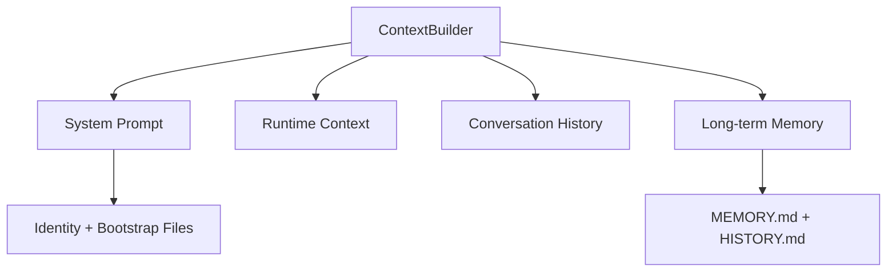

# nanobot 学习指南

<div align="center">
  
  <h1>nanobot 7天学习计划</h1>
  <p>
    <a href="https://pypi.org/project/nanobot-ai/"></a>
    <a href="https://pepy.tech/project/nanobot-ai"></a>
    
    
  </p>
</div>

## News

### 2025-03 新增：Task Queue 任务队列系统

新增任务队列工具，支持自管理 AI 任务执行：

```bash
# 添加任务（外部 Claude Code 执行）
taskqueue(action="add", title="开发功能X", instructions="请实现...", case_dir="case1")

# 查看任务列表
taskqueue(action="list")

# 查看任务详情
taskqueue(action="get", task_id="task-001")

# 连接到正在运行的任务会话
taskqueue(action="attach", task_id="task-001")
```

**核心特性：**
- 外部执行模式：使用 tmux 创建独立会话，运行 Claude Code CLI
- 任务状态管理：PENDING → RUNNING → DONE/BLOCKED/FAILED
- 自动恢复：崩溃任务自动重试（最多3次）
- 安全检查：root 用户禁止使用 --dangerously-skip-permissions

详细文档：[docs/extra-cases/nanobot-integrate-claudecode.md](./docs/extra-cases/nanobot-integrate-claudecode.md)

---

### 2025-03 新增：上下文工程完全指南

深入理解 Nanobot 的上下文工程架构：



**核心概念：**
- 上下文工程 vs 提示词工程：系统层面的上下文生命周期管理
- 两层记忆系统：MEMORY.md（长期事实）+ HISTORY.md（对话历史）
- Bootstrap Files：AGENTS.md、SOUL.md、USER.md、TOOLS.md、IDENTITY.md
- 运行时上下文：时间、渠道、聊天ID（标记为 metadata only）

详细文档：[docs/extra-cases/nanobot-context-engineering.md](./docs/extra-cases/nanobot-context-engineering.md)

---

### 2025-03 新增：Learn Mode 学习模式

新增 `learn` 命令和内置 `nanobot-learn` skill，提供两种学习模式：

```bash
# 老师模式 - 交互式问答
nanobot learn

# 指定 Day 学习
nanobot learn --day Day2

# 单次模式 - 直接问问题
nanobot learn --message "Agent Loop 是如何工作的？"

# 面试官模式 - 答题测验
nanobot learn --mode quiz
nanobot learn --mode quiz --day Day3
```

**交互式命令：**
- `/mode teacher` - 切换到老师模式
- `/mode quiz` - 切换到面试官模式
- `/stats` - 查看学习进度
- `/exit` - 退出学习模式

**内置 Skill：** `nanobot-learn` skill 会自动加载到 Agent 上下文中，用户可在任意社交媒体渠道（Discord、Telegram、Slack 等）直接使用 learn 功能。

---

## 简介

**nanobot** 是一个超轻量级的个人 AI 助手，仅用约 **4,000** 行核心代码实现了完整的 Agent 功能。本学习指南旨在通过七天的系统学习，帮助开发者全面掌握 nanobot 的实现原理，达到能够独立开发和扩展的能力。

## 学习目标

- 理解 nanobot 整体架构设计
- 掌握 Agent 核心循环（LLM ↔ Tool 交互）
- 深入理解两层记忆系统ORY.md + HISTORY（MEM.md）
- 学会扩展 Provider 和 Channel
- 能够独立开发自定义 Tool 和 Skill

## 开始学习

### 学习计划

详细内容请查看 [LEARNING_PLAN.md](./LEARNING_PLAN.md)

| Day | 主题 | 核心文件 |
|-----|------|----------|
| Day 1 | 项目结构与核心概念 | `config/schema.py`, `config/loader.py` |
| Day 2 | Agent 核心循环 | `agent/loop.py`, `agent/context.py` |
| Day 3 | Memory 与 Session | `agent/memory.py`, `session/manager.py` |
| Day 4 | Tool 与 Agent 扩展系统 | `agent/tools/`, `agent/skills.py` |
| Day 5 | Provider 系统与 LLM 集成 | `providers/registry.py` |
| Day 6 | Channel 系统 | `channels/base.py`, `channels/manager.py` |
| Day 7 | 进阶功能与实战 | `cron/service.py`, `heartbeat/service.py` |

### 前置要求

- 具备 Python 基础（async/await、类型注解）
- 了解 Pydantic 基本用法
- 熟悉 HTTP API 和 WebSocket 概念

## 快速导航

### 核心概念文档

- [Agent Loop 详解](./docs/Day2/AGENT_LOOP.md) - LLM 与工具的循环调用
- [Context 构建](./docs/Day2/CONTEXT.md) - Prompt 生成机制
- [Memory 系统](./docs/Day3/MEMORY.md) - 两层记忆设计
- [Session 管理](./docs/Day3/SESSION.md) - 会话持久化
- [Tool 系统](./docs/Day4/TOOL.md) - 工具注册和执行
- [Skills 系统](./docs/Day4/SKILLS.md) - 技能加载器
- [Subagent 系统](./docs/Day4/SUBAGENT.md) - 子 Agent 管理
- [Provider 架构](./docs/Day5/PROVIDER.md) - 多 LLM 支持
- [Channel 系统](./docs/Day6/CHANNEL.md) - 聊天平台集成
- [CLI/Cron/Heartbeat](./docs/Day7/CLI_CRON_HEARTBEAT.md) - CLI 命令、定时任务与心跳

### 项目结构

```
nanobot/
├── agent/          # 核心 agent 逻辑
│   ├── loop.py     #    Agent 循环
│   ├── context.py  #    Prompt 构建
│   ├── memory.py   #    持久化记忆
│   └── tools/      #    内置工具
├── channels/       # 聊天平台集成
├── providers/      # LLM Provider 抽象
├── session/        # 会话管理
├── config/         # 配置系统
└── cli/            # CLI 命令
```

## 面试要点

完成学习后，应掌握以下核心概念：

1. **Agent Loop** - LLM 与 Tool 的循环调用
2. **Memory System** - 两层记忆设计（MEMORY.md + HISTORY.md）
3. **Tool System** - 工具注册和执行机制
4. **Provider 抽象** - 如何支持多种 LLM
5. **Channel 抽象** - 如何接入多种聊天平台

## 相关链接

- **项目主文档**: [NanobotREADME.md](./NanobotREADME.md) - 完整的 nanobot 使用指南
- **官方文档**: https://github.com/HKUDS/nanobot
- **LiteLLM 文档**: https://docs.litellm.ai/

## 许可证

本学习指南基于 nanobot 项目，遵循 MIT 许可证。
