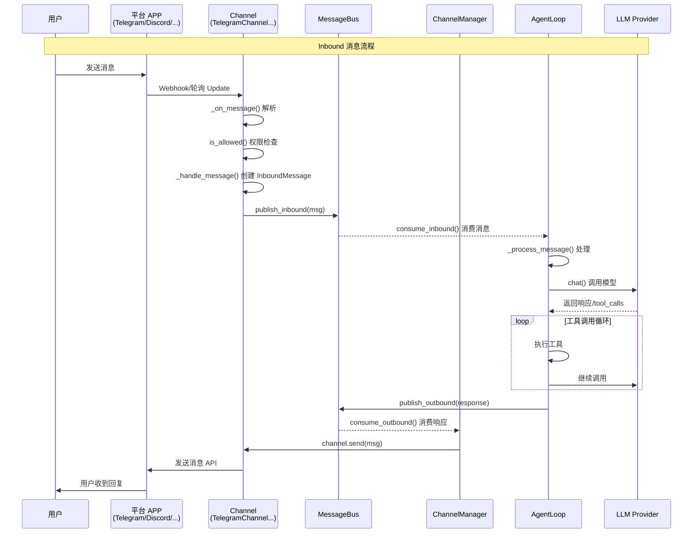

# Channel System 深入解析

> 本文档是 [LEARNING_PLAN.md](./LEARNING_PLAN.md) Day 6 的补充材料

## 概述

nanobot 的 **Channel 系统**是聊天平台集成层，负责：
1. 接收各平台消息
2. 发送响应到各平台
3. 消息格式转换

目前支持 **11 个平台**！

---

## 支持的 Channel

| Channel | 协议 | 说明 |
|---------|------|------|
| Telegram | Bot API | 长轮询，无需公网 |
| Discord | Gateway | Discord 机器人 |
| WhatsApp | WebSocket | WhatsApp Business API |
| Feishu | WebSocket | 飞书/Lark |
| QQ | botpy SDK | QQ 机器人 |
| DingTalk | Stream | 钉钉 Stream 模式 |
| Slack | Socket Mode | Slack 机器人 |
| Email | IMAP/SMTP | 邮件收发 |
| Matrix | Client-Server | Matrix 协议，支持 E2EE |
| Mochat | API | 莫愁机器人 |

---

## 架构概览

```
┌─────────────────────────────────────────────────────────────────┐
│                      ChannelManager                              │
│  ┌─────────────────────────────────────────────────────────┐   │
│  │ channels: dict[str, BaseChannel]                        │   │
│  │  - telegram    → TelegramChannel                        │   │
│  │  - discord     → DiscordChannel                        │   │
│  │  - whatsapp    → WhatsAppChannel                       │   │
│  │  - ...                                               │   │
│  └─────────────────────────────────────────────────────────┘   │
│                                                                 │
│  职责：                                                        │
│  1. 初始化所有启用的 Channel                                   │
│  2. 启动/停止所有 Channel                                      │
│  3. 路由 outbound 消息                                          │
└─────────────────────────────────────────────────────────────────┘
                              │
                              ▼
┌─────────────────────────────────────────────────────────────────┐
│                       MessageBus                                 │
│                                                                 │
│   inbound_queue  ◄────── Channel._handle_message()            │
│                                                                  │
│   outbound_queue ◄───── AgentLoop._process_message()            │
│                              │                                  │
│                              ▼                                  │
│                    ChannelManager._dispatch_outbound()          │
│                              │                                  │
│                              ▼                                  │
│                    Channel.send() ──────────► 用户              │
└─────────────────────────────────────────────────────────────────┘
```

---

## MessageBus - 消息总线

`MessageBus` 是 Channel 和 Agent 核心之间的**解耦器**，使用 `asyncio.Queue` 实现异步消息传递。

### 类定义

```python
class MessageBus:
    """
    Async message bus that decouples chat channels from the agent core.

    Channels push messages to the inbound queue, and the agent processes
    them and pushes responses to the outbound queue.
    """

    def __init__(self):
        self.inbound: asyncio.Queue[InboundMessage] = asyncio.Queue()
        self.outbound: asyncio.Queue[OutboundMessage] = asyncio.Queue()
```

### 核心方法

| 方法 | 说明 |
|------|------|
| `publish_inbound(msg)` | Channel 发布用户消息到入站队列 |
| `consume_inbound()` | Agent 消费入站消息（阻塞等待） |
| `publish_outbound(msg)` | Agent 发布响应消息到出站队列 |
| `consume_outbound()` | ChannelManager 消费出站消息 |

### 消息类型

#### InboundMessage

```python
@dataclass
class InboundMessage:
    """Message received from a chat channel."""

    channel: str           # telegram, discord, slack, whatsapp
    sender_id: str         # 用户标识
    chat_id: str          # 会话/群组标识
    content: str          # 消息内容
    timestamp: datetime    # 时间戳
    media: list[str]      # 媒体文件路径列表
    metadata: dict        # 平台特定数据
    session_key_override: str | None  # 可选的会话 key 覆盖

    @property
    def session_key(self) -> str:
        """Unique key for session identification."""
        return self.session_key_override or f"{self.channel}:{self.chat_id}"
```

#### OutboundMessage

```python
@dataclass
class OutboundMessage:
    """Message to send to a chat channel."""

    channel: str           # 目标 Channel 名称
    chat_id: str          # 目标会话
    content: str          # 响应内容
    reply_to: str | None  # 回复目标消息 ID
    media: list[str]      # 媒体文件路径
    metadata: dict        # 额外元数据
```

### 设计优点

1. **完全解耦** - Channel 和 Agent 独立运行，互不感知
2. **异步处理** - 使用 asyncio.Queue 非阻塞传递
3. **缓冲能力** - 队列可缓冲突发流量
4. **统一接口** - 所有 Channel 使用相同协议

---

## BaseChannel 抽象基类

```python
class BaseChannel(ABC):
    """Abstract base class for chat channel implementations."""

    name: str = "base"

    def __init__(self, config: Any, bus: MessageBus):
        self.config = config
        self.bus = bus
        self._running = False

    @abstractmethod
    async def start(self) -> None:
        """Start the channel and begin listening for messages."""
        pass

    @abstractmethod
    async def stop(self) -> None:
        """Stop the channel and clean up resources."""
        pass

    @abstractmethod
    async def send(self, msg: OutboundMessage) -> None:
        """Send a message through this channel."""
        pass

    def is_allowed(self, sender_id: str) -> bool:
        """Check if sender is permitted. Empty list → deny all; "*" → allow all."""
        allow_list = getattr(self.config, "allow_from", [])
        if not allow_list:
            return False
        if "*" in allow_list:
            return True
        return sender_id in allow_list

    async def _handle_message(self, sender_id: str, chat_id: str, content: str, ...) -> None:
        """Handle incoming message, check permissions, forward to bus."""
        if not self.is_allowed(sender_id):
            return
        msg = InboundMessage(channel=self.name, sender_id=..., chat_id=..., content=...)
        await self.bus.publish_inbound(msg)
```

---

## ChannelManager - 通道管理器

ChannelManager 负责**统一管理**所有 Channel，包括初始化、启动、停止和消息路由。

### 类定义

```python
class ChannelManager:
    """
    Manages chat channels and coordinates message routing.

    Responsibilities:
    - Initialize enabled channels (Telegram, WhatsApp, etc.)
    - Start/stop channels
    - Route outbound messages
    """

    def __init__(self, config: Config, bus: MessageBus):
        self.config = config
        self.bus = bus
        self.channels: dict[str, BaseChannel] = {}
        self._dispatch_task: asyncio.Task | None = None

        self._init_channels()
```

### 初始化流程

```python
def _init_channels(self) -> None:
    """Initialize channels based on config."""

    # Telegram channel
    if self.config.channels.telegram.enabled:
        try:
            from nanobot.channels.telegram import TelegramChannel
            self.channels["telegram"] = TelegramChannel(
                self.config.channels.telegram,
                self.bus,
                groq_api_key=self.config.providers.groq.api_key,
            )
            logger.info("Telegram channel enabled")
        except ImportError as e:
            logger.warning("Telegram channel not available: {}", e)

    # WhatsApp channel
    if self.config.channels.whatsapp.enabled:
        ...

    # Discord channel
    if self.config.channels.discord.enabled:
        ...

    # ... 其他 Channel
```

**关键点**：
- 延迟导入 Channel 实现类（如 TelegramChannel）
- 根据配置 `config.channels.xxx.enabled` 判断是否启用
- 捕获 ImportError 允许可选依赖
- 调用 `_validate_allow_from()` 验证权限配置

### 启动流程

```python
async def start_all(self) -> None:
    """Start all channels and the outbound dispatcher."""
    if not self.channels:
        logger.warning("No channels enabled")
        return

    # 1. 启动 outbound 分发器（后台任务）
    self._dispatch_task = asyncio.create_task(self._dispatch_outbound())

    # 2. 启动所有 Channel
    tasks = []
    for name, channel in self.channels.items():
        logger.info("Starting {} channel...", name)
        tasks.append(asyncio.create_task(self._start_channel(name, channel)))

    # 3. 等待所有 Channel 启动完成
    await asyncio.gather(*tasks, return_exceptions=True)
```

### Outbound 消息分发

```python
async def _dispatch_outbound(self) -> None:
    """Dispatch outbound messages to the appropriate channel."""
    logger.info("Outbound dispatcher started")

    while True:
        try:
            # 从队列消费出站消息（带超时避免阻塞）
            msg = await asyncio.wait_for(
                self.bus.consume_outbound(),
                timeout=1.0
            )

            # 处理进度消息过滤
            if msg.metadata.get("_progress"):
                if msg.metadata.get("_tool_hint") and not self.config.channels.send_tool_hints:
                    continue
                if not msg.metadata.get("_tool_hint") and not self.config.channels.send_progress:
                    continue

            # 查找目标 Channel 并发送
            channel = self.channels.get(msg.channel)
            if channel:
                try:
                    await channel.send(msg)
                except Exception as e:
                    logger.error("Error sending to {}: {}", msg.channel, e)
            else:
                logger.warning("Unknown channel: {}", msg.channel)

        except asyncio.TimeoutError:
            continue
        except asyncio.CancelledError:
            break
```

**关键点**：
- 后台任务持续监听出站队列
- 支持进度消息过滤（`_progress`, `_tool_hint`）
- 异常捕获确保单个 Channel 失败不影响其他 Channel

### 停止流程

```python
async def stop_all(self) -> None:
    """Stop all channels and the dispatcher."""
    logger.info("Stopping all channels...")

    # 1. 取消 dispatcher 任务
    if self._dispatch_task:
        self._dispatch_task.cancel()
        try:
            await self._dispatch_task
        except asyncio.CancelledError:
            pass

    # 2. 停止所有 Channel
    for name, channel in self.channels.items():
        try:
            await channel.stop()
            logger.info("Stopped {} channel", name)
        except Exception as e:
            logger.error("Error stopping {}: {}", name, e)
```

### 权限验证

```python
def _validate_allow_from(self) -> None:
    for name, ch in self.channels.items():
        if getattr(ch.config, "allow_from", None) == []:
            raise SystemExit(
                f'Error: "{name}" has empty allowFrom (denies all). '
                f'Set ["*"] to allow everyone, or add specific user IDs.'
            )
```

---

## Channel 实现示例：Telegram

Telegram Channel 使用 **python-telegram-bot** 库，基于**长轮询**模式接收消息，无需公网 IP 或 Webhook。

### 类定义

```python
class TelegramChannel(BaseChannel):
    """
    Telegram channel using long polling.

    Simple and reliable - no webhook/public IP needed.
    """

    name = "telegram"

    # Commands registered with Telegram's command menu
    BOT_COMMANDS = [
        BotCommand("start", "Start the bot"),
        BotCommand("new", "Start a new conversation"),
        BotCommand("stop", "Stop the current task"),
        BotCommand("help", "Show available commands"),
    ]

    def __init__(
        self,
        config: TelegramConfig,
        bus: MessageBus,
        groq_api_key: str = "",
    ):
        super().__init__(config, bus)
        self._app: Application | None = None
        self._chat_ids: dict[str, int] = {}  # Map sender_id to chat_id for replies
        self._typing_tasks: dict[str, asyncio.Task] = {}  # chat_id -> typing loop task
        self._media_group_buffers: dict[str, dict] = {}
        self._media_group_tasks: dict[str, asyncio.Task] = {}
```

### start() - 启动 Bot

```python
async def start(self) -> None:
    """Start the Telegram bot with long polling."""
    if not self.config.token:
        logger.error("Telegram bot token not configured")
        return

    self._running = True

    # 1. 构建 Application（配置连接池）
    req = HTTPXRequest(
        connection_pool_size=16,
        pool_timeout=5.0,
        connect_timeout=30.0,
        read_timeout=30.0
    )
    builder = Application.builder().token(self.config.token).request(req).get_updates_request(req)

    # 支持代理
    if self.config.proxy:
        builder = builder.proxy(self.config.proxy).get_updates_proxy(self.config.proxy)

    self._app = builder.build()
    self._app.add_error_handler(self._on_error)

    # 2. 注册处理器
    # 命令处理器
    self._app.add_handler(CommandHandler("start", self._on_start))
    self._app.add_handler(CommandHandler("new", self._forward_command))
    self._app.add_handler(CommandHandler("help", self._on_help))

    # 消息处理器（文本、图片、语音、文档）
    self._app.add_handler(
        MessageHandler(
            (filters.TEXT | filters.PHOTO | filters.VOICE | filters.AUDIO | filters.Document.ALL)
            & ~filters.COMMAND,
            self._on_message
        )
    )

    # 3. 初始化并启动轮询
    await self._app.initialize()
    await self._app.start()

    bot_info = await self._app.bot.get_me()
    logger.info("Telegram bot @{} connected", bot_info.username)

    # 注册命令菜单
    await self._app.bot.set_my_commands(self.BOT_COMMANDS)

    # 4. 开始长轮询
    await self._app.updater.start_polling(
        allowed_updates=["message"],
        drop_pending_updates=True  # 启动时忽略旧消息
    )

    # 保持运行
    while self._running:
        await asyncio.sleep(1)
```

### send() - 发送消息

```python
async def send(self, msg: OutboundMessage) -> None:
    """Send a message through Telegram."""
    if not self._app:
        logger.warning("Telegram bot not running")
        return

    # 停止 typing 指示器
    self._stop_typing(msg.chat_id)

    chat_id = int(msg.chat_id)

    # 处理回复参数
    reply_params = None
    if self.config.reply_to_message:
        reply_to_message_id = msg.metadata.get("message_id")
        if reply_to_message_id:
            reply_params = ReplyParameters(
                message_id=reply_to_message_id,
                allow_sending_without_reply=True
            )

    # 1. 发送媒体文件
    for media_path in (msg.media or []):
        media_type = self._get_media_type(media_path)
        sender = {
            "photo": self._app.bot.send_photo,
            "voice": self._app.bot.send_voice,
            "audio": self._app.bot.send_audio,
        }.get(media_type, self._app.bot.send_document)
        with open(media_path, 'rb') as f:
            await sender(chat_id=chat_id, **{media_type: f}, reply_parameters=reply_params)

    # 2. 发送文本内容（Markdown → HTML 转换）
    if msg.content and msg.content != "[empty message]":
        for chunk in _split_message(msg.content):
            html = _markdown_to_telegram_html(chunk)
            try:
                await self._app.bot.send_message(
                    chat_id=chat_id,
                    text=html,
                    parse_mode="HTML",
                    reply_parameters=reply_params
                )
            except Exception as e:
                # HTML 解析失败，回退到纯文本
                await self._app.bot.send_message(
                    chat_id=chat_id,
                    text=chunk,
                    reply_parameters=reply_params
                )
```

### Markdown 到 HTML 转换

```python
def _markdown_to_telegram_html(text: str) -> str:
    """Convert markdown to Telegram-safe HTML."""
    # 1. 保护代码块
    code_blocks = []
    text = re.sub(r'```[\w]*\n?([\s\S]*?)```', save_code_block, text)

    # 2. 保护行内代码
    inline_codes = []
    text = re.sub(r'`([^`]+)`', save_inline_code, text)

    # 3. Headers, Blockquotes, Escape HTML
    text = re.sub(r'^#{1,6}\s+(.+)$', r'\1', text, flags=re.MULTILINE)
    text = text.replace("&", "&amp;").replace("<", "&lt;").replace(">", "&gt;")

    # 4. 链接、粗体、斜体
    text = re.sub(r'\[([^\]]+)\]\(([^)]+)\)', r'<a href="\2">\1</a>', text)
    text = re.sub(r'\*\*(.+?)\*\*', r'<b>\1</b>', text)
    text = re.sub(r'(?<![a-zA-Z0-9])_([^_]+)_(?![a-zA-Z0-9])', r'<i>\1</i>', text)

    # 5. 恢复代码块
    for i, code in enumerate(code_blocks):
        text = text.replace(f"\x00CB{i}\x00", f"<pre><code>{code}</code></pre>")

    return text
```

### 消息接收处理

```python
async def _on_message(self, update: Update, context: ContextTypes.DEFAULT_TYPE) -> None:
    """Handle incoming messages (text, photos, voice, documents)."""
    message = update.message
    user = update.effective_user
    chat_id = message.chat_id
    sender_id = self._sender_id(user)

    # 存储 chat_id 用于回复
    self._chat_ids[sender_id] = chat_id

    # 构建内容
    content_parts = []
    media_paths = []

    # 文本内容
    if message.text:
        content_parts.append(message.text)
    if message.caption:
        content_parts.append(message.caption)

    # 处理媒体文件（下载到本地）
    if message.photo:
        file = await self._app.bot.get_file(message.photo[-1].file_id)
        file_path = media_dir / f"{file.file_id[:16]}.jpg"
        await file.download_to_drive(str(file_path))
        media_paths.append(str(file_path))
        content_parts.append(f"[image: {file_path}]")

    # 语音转录（使用 Groq）
    if message.voice:
        from nanobot.providers.transcription import GroqTranscriptionProvider
        transcriber = GroqTranscriptionProvider(api_key=self.groq_api_key)
        transcription = await transcriber.transcribe(file_path)
        content_parts.append(f"[transcription: {transcription}]")

    content = "\n".join(content_parts)

    # 发送 typing 指示器
    self._start_typing(str_chat_id)

    # 发送到 MessageBus
    await self._handle_message(
        sender_id=sender_id,
        chat_id=str_chat_id,
        content=content,
        media=media_paths,
        metadata={
            "message_id": message.message_id,
            "user_id": user.id,
            "username": user.username,
            "first_name": user.first_name,
            "is_group": message.chat.type != "private"
        }
    )
```

### Media Group 处理

Telegram 的 media group（多图发送）会拆分为多条消息，Channel 需要缓冲后聚合：

```python
async def _on_message(self, update: Update, context: ContextTypes.DEFAULT_TYPE) -> None:
    # Media Group 缓冲
    if media_group_id := getattr(message, "media_group_id", None):
        key = f"{str_chat_id}:{media_group_id}"
        if key not in self._media_group_buffers:
            self._media_group_buffers[key] = {...}
            self._media_group_tasks[key] = asyncio.create_task(self._flush_media_group(key))
        # 缓冲内容
        return

    # 普通消息直接处理
    await self._handle_message(...)

async def _flush_media_group(self, key: str) -> None:
    """Wait briefly, then forward buffered media-group as one turn."""
    await asyncio.sleep(0.6)  # 等待 0.6 秒收集所有消息
    content = "\n".join(buf["contents"]) or "[empty message]"
    await self._handle_message(
        sender_id=buf["sender_id"],
        chat_id=buf["chat_id"],
        content=content,
        media=list(dict.fromkeys(buf["media"])),
        metadata=buf["metadata"],
    )
```

### Typing 指示器

```python
def _start_typing(self, chat_id: str) -> None:
    """Start sending 'typing...' indicator for a chat."""
    self._stop_typing(chat_id)
    self._typing_tasks[chat_id] = asyncio.create_task(self._typing_loop(chat_id))

async def _typing_loop(self, chat_id: str) -> None:
    """Repeatedly send 'typing' action until cancelled."""
    try:
        while self._app:
            await self._app.bot.send_chat_action(chat_id=int(chat_id), action="typing")
            await asyncio.sleep(4)  # Telegram 要求每 4 秒发送一次
    except asyncio.CancelledError:
        pass
```

---

## 消息流程

### 完整架构图



### 详细流程说明

#### 1. Channel 如何接收消息？

不同平台有**不同的消息接收机制**：

| 平台 | 接收方式 | 说明 |
|------|----------|------|
| Telegram | 长轮询 | `Application.run_polling()` 持续拉取消息 |
| Discord | Gateway | WebSocket 长连接 |
| WhatsApp | Webhook | 服务器推送 |
| Feishu | Webhook | 服务器推送 |
| Slack | Socket Mode | WebSocket |
| Email | IMAP | 定时轮询邮箱 |

**以 Telegram 为例**：

```python
# TelegramChannel.start() 中启动长轮询
await self._app.updater.start_polling(
    allowed_updates=["message"],
    drop_pending_updates=True
)

# 消息通过回调到达
async def _on_message(self, update: Update, context: ContextTypes.DEFAULT_TYPE):
    # update 包含用户发送的消息
    await self._handle_message(...)
```

#### 2. 消息如何处理传递给 Bus？

```python
async def _on_message(self, update: Update, context: ContextTypes.DEFAULT_TYPE):
    """接收并解析消息"""
    message = update.message
    user = update.effective_user

    # 1. 解析消息内容（文本+媒体）
    content = message.text
    media_paths = []

    if message.photo:
        # 下载图片
        file = await self._app.bot.get_file(message.photo[-1].file_id)
        media_paths.append(file_path)

    # 2. 调用 _handle_message（权限检查+发送到 Bus）
    await self._handle_message(
        sender_id=str(user.id),
        chat_id=str(message.chat_id),
        content=content,
        media=media_paths,
        metadata={...}
    )

# BaseChannel 中的实现
async def _handle_message(self, sender_id: str, chat_id: str, content: str, ...) -> None:
    # 1. 权限检查
    if not self.is_allowed(sender_id):
        return

    # 2. 创建 InboundMessage
    msg = InboundMessage(
        channel=self.name,
        sender_id=sender_id,
        chat_id=chat_id,
        content=content,
        media=media,
        metadata=metadata
    )

    # 3. 发布到 MessageBus
    await self.bus.publish_inbound(msg)
```

#### 3. Bus 如何与 Agent Loop 交互？

**AgentLoop.run()** - 持续监听入站队列：

```python
async def run(self) -> None:
    """Agent 核心循环"""
    self._running = True

    while self._running:
        try:
            # 阻塞等待消息（带超时避免无法退出）
            msg = await asyncio.wait_for(
                self.bus.consume_inbound(),
                timeout=1.0
            )
        except asyncio.TimeoutError:
            continue

        # 为每个消息创建独立任务（支持并发）
        task = asyncio.create_task(self._dispatch(msg))
        self._active_tasks.setdefault(msg.session_key, []).append(task)

async def _dispatch(self, msg: InboundMessage) -> None:
    """分发消息处理"""
    async with self._processing_lock:  # 全局锁避免并发冲突
        try:
            response = await self._process_message(msg)
            if response is not None:
                # 发布响应到出站队列
                await self.bus.publish_outbound(response)
        except Exception as e:
            # 错误处理
            await self.bus.publish_outbound(OutboundMessage(...))
```

**ChannelManager._dispatch_outbound()** - 监听出站队列：

```python
async def _dispatch_outbound(self) -> None:
    """分发出站消息"""
    while True:
        msg = await asyncio.wait_for(
            self.bus.consume_outbound(),
            timeout=1.0
        )

        # 查找对应 Channel
        channel = self.channels.get(msg.channel)
        if channel:
            await channel.send(msg)
```

---

## 权限控制

每个 Channel 支持 `allow_from` 配置：

```json
{
  "channels": {
    "telegram": {
      "enabled": true,
      "token": "xxx",
      "allow_from": ["123456789", "987654321"]
    }
  }
}
```

- `[]` (空) → 拒绝所有
- `["*"]` → 允许所有
- `["id1", "id2"]` → 只允许指定用户

---

## 添加新 Channel

1. **创建 Channel 类**（继承 BaseChannel）
   ```python
   class NewChannel(BaseChannel):
       name = "newchannel"

       async def start(self) -> None: ...
       async def stop(self) -> None: ...
       async def send(self, msg: OutboundMessage) -> None: ...
   ```

2. **在 ChannelManager 中注册**
   ```python
   if self.config.channels.newchannel.enabled:
       self.channels["newchannel"] = NewChannel(...)
   ```

3. **在 Config 中添加配置**
   - 在 `config/schema.py` 添加 `NewChannelConfig`

---

## 面试要点

1. **Channel 的核心职责？**
   - 消息接收（start + _handle_message）
   - 消息发送（send）
   - 权限控制（is_allowed）

2. **ChannelManager 的作用？**
   - 统一管理所有 Channel
   - 路由 outbound 消息
   - 启动/停止协调

3. **MessageBus 的设计优点？**
   - 完全解耦 Channel 和 Agent
   - 异步队列实现非阻塞
   - 支持突发流量缓冲

4. **消息流程？**
   - Inbound：平台 → _handle_message → MessageBus → AgentLoop
   - Outbound：AgentLoop → MessageBus → ChannelManager → Channel.send() → 平台

5. **为什么用 MessageBus 解耦？**
   - Channel 和 Agent 独立
   - 支持多个 Channel
   - 异步处理

6. **Telegram Channel 的特点？**
   - 长轮询模式，无需公网
   - 支持媒体文件处理
   - 支持 Markdown → HTML 转换
   - 支持 typing 指示器

7. **如何添加新 Channel？**
   - 继承 BaseChannel
   - 实现 start/stop/send
   - 在 ChannelManager 注册
   - 在 Config 添加配置

---

## 文件位置

- 源文件：
  - `nanobot/channels/base.py` - BaseChannel 基类
  - `nanobot/channels/manager.py` - Channel 管理器
  - `nanobot/channels/telegram.py` - Telegram 实现
  - `nanobot/channels/discord.py` - Discord 实现
  - `nanobot/channels/email.py` - Email 实现
  - 其他 Channel 实现...
- 相关文件：
  - `nanobot/bus/queue.py` - MessageBus
  - `nanobot/bus/events.py` - 消息事件
  - `nanobot/config/schema.py` - Channel 配置
