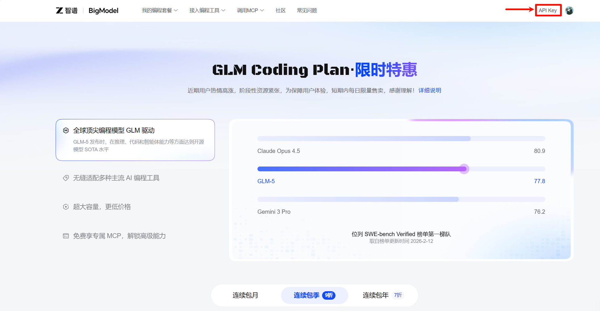
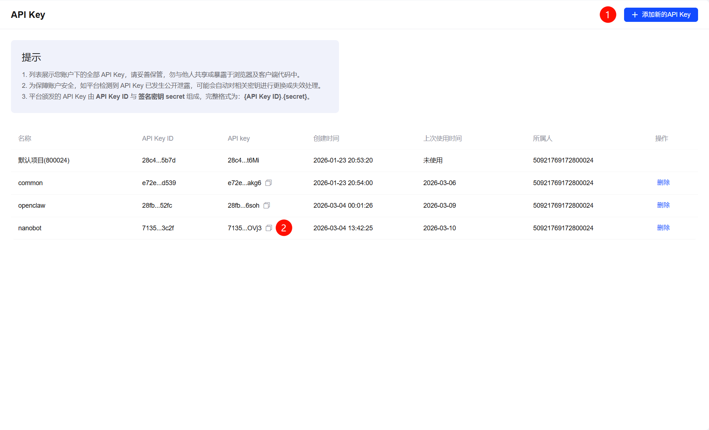
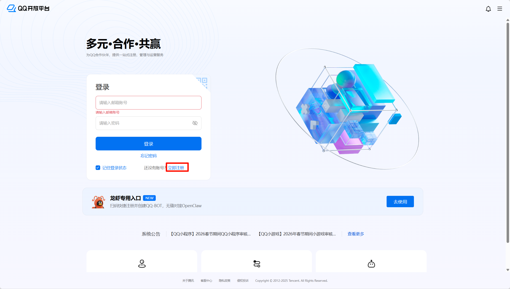
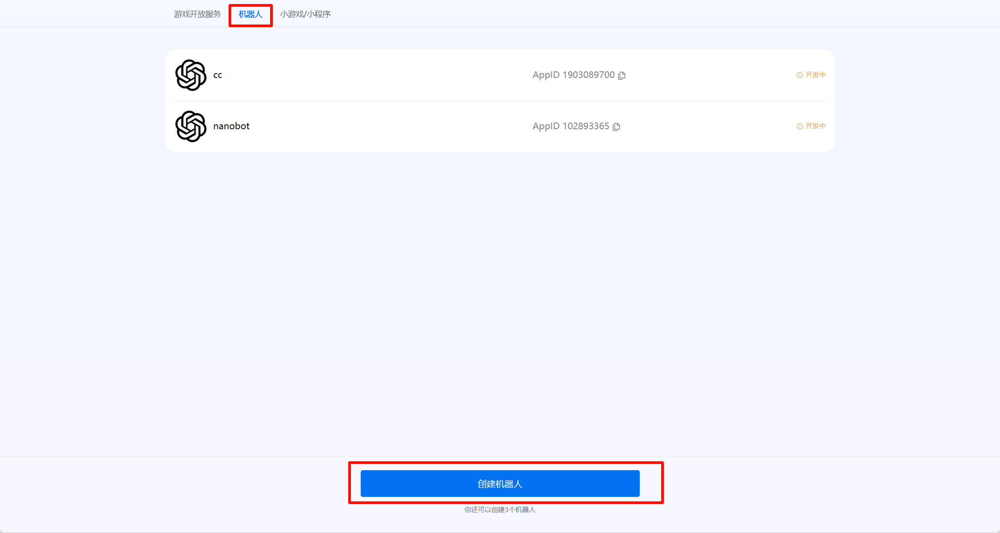
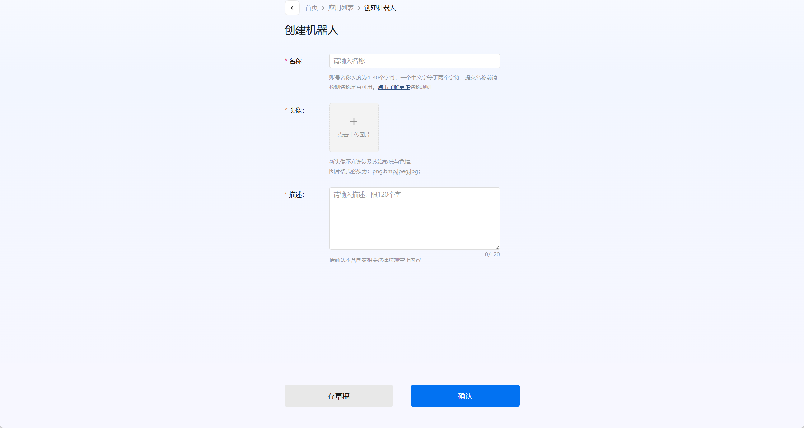
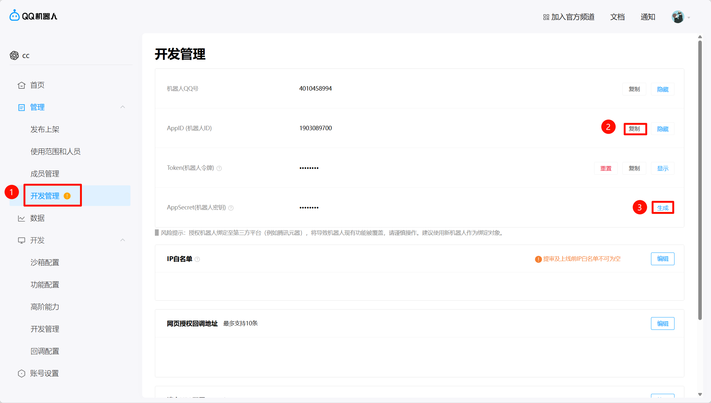
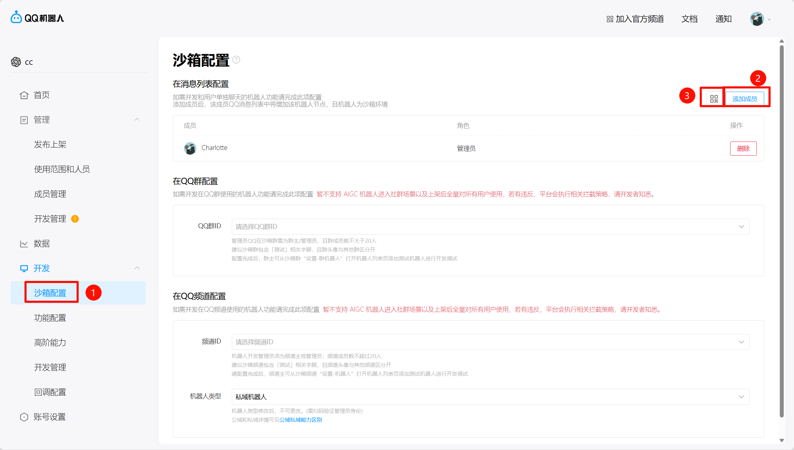
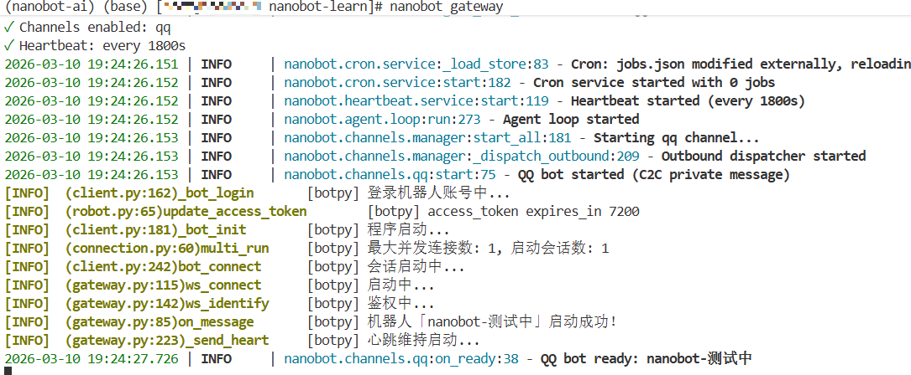
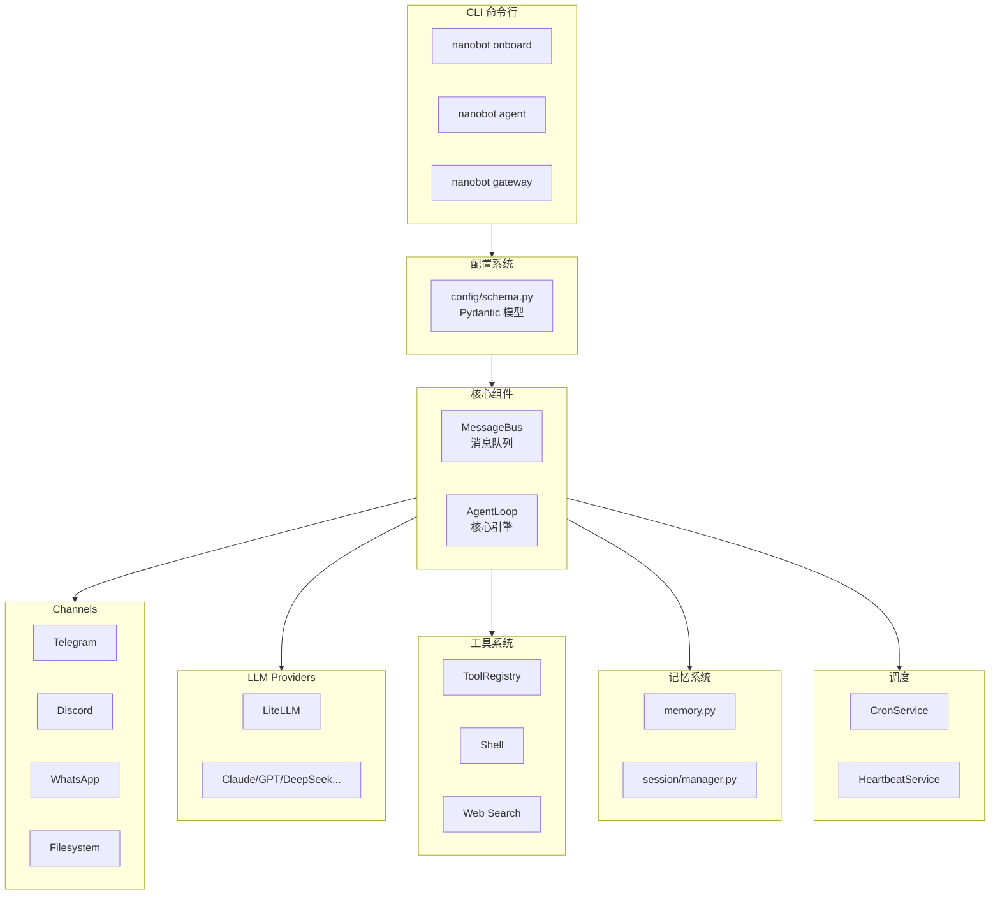

# Day 1: 项目结构与配置系统

> 本文档是 [LEARNING_PLAN.md](../../LEARNING_PLAN.md) Day 1 的补充材料

---

## 1. 项目概览

### 什么是 nanobot？


**nanobot** 是 HKUDS 开源的**超轻量级个人 AI 助手**，核心代码仅 **~4,000 行**，比 Clawdbot 小 99%。
极致的轻量化，接口定义清晰，你可以在此基础上自定义各种功能。

```
📊 代码量对比
┌─────────────┬─────────────┐
│ Clawdbot    │   430,000+  │
│ nanobot     │     ~4,000  │
└─────────────┴─────────────┘
```

### 核心特性

| 特性 | 说明 |
|------|------|
| 🪶 超轻量 | 仅 ~4,000 行核心代码 |
| 🔌 多平台 | 支持 11+ 聊天平台 |
| 🧠 多模型 | 支持 Claude/GPT/DeepSeek/通义等 |
| 🛠️ 工具生态 | Shell/文件/Web/MCP/定时任务 |
| 💓 主动唤醒 | Heartbeat 定期检查任务 |

### 支持的 Channel

| Channel | 协议 | 说明 |
|---------|------|------|
| Telegram | Bot API | 长轮询，无需公网 |
| Discord | Gateway | Discord 机器人 |
| WhatsApp | WebSocket | WhatsApp Business API |
| Feishu | WebSocket | 飞书/Lark |
| QQ | botpy SDK | QQ 机器人 |
| DingTalk | Stream | 钉钉 Stream 模式 |
| Slack | Socket Mode | Slack 机器人 |
| Email | IMAP/SMTP | 邮件收发 |
| Matrix | Client-Server | Matrix 协议，支持 E2EE |
| Mochat | API | 莫愁机器人 |

### 支持的 Provider

| 类型 | Provider |
|------|----------|
| Gateway | OpenRouter, AiHubMix, SiliconFlow, VolcEngine |
| Standard | Anthropic, OpenAI, DeepSeek, Gemini, Zhipu, DashScope, Moonshot, MiniMax |
| Local | vLLM |
| OAuth | OpenAI Codex, Github Copilot |

---

## 2. 快速启动
## 2.1 克隆Github仓库
**官方仓库**
```
git clone https://github.com/HKUDS/nanobot.git
cd nanobot
pip install -e .
```
**nanobot learn**
```
https://github.com/WOWCharlotte/nanobot-learn.git
cd nanobot-learn
pip install -e .
```
## 2.2 初始化
执行`nanobot onboard`命令，会生成`~/.nanobot/config.json`文件

## 2.3 配置模型供应商
我这里选择的是`glm-5`模型，nanobot支持多种模型配置，你可以自由选择
1. 登录智谱开放平台，注册账号，点击APIKEY

2. 获取APIKEY

3. 配置`~/.nanobot/config.json`文件
```
"providers": {
    "zhipu": {
      "apiKey": "",
      "apiBase": "https://open.bigmodel.cn/api/paas/v4",
      "extraHeaders": null
    },
}
```
```
"agents": {
    "defaults": {
      "workspace": "~/.nanobot/workspace",
      "model": "glm-5",
      "provider": "zhipu",
      "maxTokens": 8192,
      "temperature": 0.1,
      "maxToolIterations": 40,
      "memoryWindow": 100,
      "reasoningEffort": null
    }
}
```
## 2.3 启动 nanobot
配置好模型供应商后，执行`nanobot agent`命令，进入交互模式，输入"hi"，如果模型正常回复，说明配置成功
## 2.4 配置Channel
> 如果想在手机APP上跟nanobot对话，我们需要配置一下Channel，我这里选择的是QQ。
1. 注册账号
    - 访问[QQ开放平台](https://q.qq.com/#/)
    - 点击立即注册
    
    - 按照步骤注册，主体选择**个人**，注意手机号必须是用你的身份证注册的，否则会提示输入姓名与身份证上的姓名不符合🤡
2. 登录并创建机器人
    - 登录[QQ开放平台](https://q.qq.com/#/)，点击机器人，点击创建机器人
    
    - 填写机器人信息
    
    - 点击创建好的机器人进入**开发管理**，复制**AppID**，生成**AppSecret**
    
    - 点击沙箱配置，点击添加成员，完成后扫码
    
    - 创建完成后，你应该就可以在自己的QQ列表里找到机器人了，但此时的机器人还不能工作，我们还需要配置Channel
3. 配置`~/.nanobot/config.json`文件
    需要将`enabled`设置为`true`,填入刚刚复制来的AppID和AppSecret，将`allowFrom`设置为`["*"]`，这表示所有来源都可以访问
    ```
    "qq": {
        "enabled": true,
        "appId": "",
        "secret": "",
        "allowFrom": [
            "*"
        ]
        },
    ```
4. 执行 `nanobot gateway` 启动nanobot连接QQ机器人

恭喜你已经完成了Nanobot的基本配置，接下来是Nanobot的深入讲解，你准备好了么？


## 2. 项目结构

```
nanobot/
├── agent/          # 🧠 核心 Agent 逻辑
│   ├── loop.py     #    Agent 循环 (LLM ↔ 工具执行)
│   ├── context.py  #    Prompt 构建器
│   ├── memory.py   #    持久化记忆
│   ├── skills.py   #    技能加载器
│   ├── subagent.py #    后台任务执行
│   └── tools/      #    内置工具
│
├── skills/         # 🎯 内置技能 (github, weather, tmux...)
│
├── channels/       # 📱 聊天平台集成
│   ├── base.py     #    Channel 基类
│   ├── manager.py  #    Channel 管理器
│   ├── telegram.py #    Telegram 实现
│   ├── discord.py #    Discord 实现
│   └── ...         #    其他平台
│
├── providers/      # 🤖 LLM Provider (OpenRouter, Anthropic...)
│   ├── registry.py #    Provider 注册表
│   ├── base.py    #    Provider 接口
│   └── litellm_provider.py  # LiteLLM 实现
│
├── bus/            # 🚌 消息路由
│   ├── queue.py   #    MessageBus 队列
│   └── events.py  #    消息事件定义
│
├── cron/           # ⏰ 定时任务
│   ├── service.py #    Cron 服务
│   └── types.py   #    Cron 数据类型
│
├── heartbeat/      # 💓 心跳服务
│   └── service.py #    Heartbeat 实现
│
├── session/        # 💬 会话管理
│   └── manager.py #    Session 管理器
│
├── config/         # ⚙️ 配置系统
│   ├── schema.py  #    Pydantic 配置模型
│   └── loader.py #    配置加载
│
├── cli/            # 🖥️ 命令行
│   └── commands.py #    CLI 命令
│
└── templates/      # 📄 模板文件
    ├── AGENTS.md
    ├── HEARTBEAT.md
    ├── SOUL.md
    ├── TOOLS.md
    └── USER.md
```

### 各模块职责

| 模块 | 核心文件 | 职责 |
|------|----------|------|
| **agent** | `loop.py` | 核心循环：LLM ↔ 工具调用 |
| **channels** | `base.py`, `manager.py` | 聊天平台接入 |
| **providers** | `registry.py` | LLM 抽象层 |
| **bus** | `queue.py` | 消息队列解耦 |
| **cron** | `service.py` | 定时任务调度 |
| **heartbeat** | `service.py` | 主动唤醒机制 |
| **session** | `manager.py` | 会话持久化 |
| **config** | `schema.py` | 配置验证 |
| **cli** | `commands.py` | 命令行入口 |

---

## 3. 配置系统

nanobot 使用 **Pydantic** 进行配置验证和类型安全。

### 核心配置模型

```python
class Config(BaseSettings):
    """Root configuration for nanobot."""

    agents: AgentsConfig           # Agent 默认配置
    channels: ChannelsConfig      # Channel 配置
    providers: ProvidersConfig    # LLM Provider 配置
    gateway: GatewayConfig        # Gateway 配置
    tools: ToolsConfig            # 工具配置
```

### 详细配置

#### AgentsConfig

```python
class AgentDefaults(Base):
    workspace: str = "~/.nanobot/workspace"     # 工作区路径
    model: str = "anthropic/claude-opus-4-5"   # 默认模型
    provider: str = "auto"                       # 自动检测
    max_tokens: int = 8192
    temperature: float = 0.1
    max_tool_iterations: int = 40               # 最大工具调用次数
    memory_window: int = 100                   # 记忆窗口大小
    reasoning_effort: str | None = None        # 推理强度 (low/medium/high)
```

#### ProvidersConfig

```python
class ProvidersConfig(Base):
    # Gateway
    openrouter: ProviderConfig    # 全球网关
    aihubmix: ProviderConfig      # API 网关
    siliconflow: ProviderConfig   # 硅基流动
    volcengine: ProviderConfig    # 火山引擎

    # Standard
    anthropic: ProviderConfig     # Claude
    openai: ProviderConfig        # GPT
    deepseek: ProviderConfig      # DeepSeek
    gemini: ProviderConfig        # Gemini
    zhipu: ProviderConfig         # 智谱 GLM
    dashscope: ProviderConfig      # 通义千问
    moonshot: ProviderConfig       # Kimi
    minimax: ProviderConfig       # MiniMax

    # Local / OAuth
    vllm: ProviderConfig          # 本地部署
    openai_codex: ProviderConfig  # OAuth
    github_copilot: ProviderConfig # OAuth
```

#### ChannelConfig

```python
class ChannelsConfig(Base):
    send_progress: bool = True      # 流式输出进度
    send_tool_hints: bool = False  # 显示工具调用提示

    # 各平台配置
    telegram: TelegramConfig
    discord: DiscordConfig
    whatsapp: WhatsAppConfig
    feishu: FeishuConfig
    dingtalk: DingTalkConfig
    slack: SlackConfig
    email: EmailConfig
    qq: QQConfig
    matrix: MatrixConfig
    mochat: MochatConfig
```

#### ToolsConfig

```python
class ToolsConfig(Base):
    web: WebToolsConfig       # 网页工具
    exec: ExecToolConfig       # Shell 执行
    restrict_to_workspace: bool = False  # 限制工作区
    mcp_servers: dict         # MCP 服务器配置
```

### 配置示例

```json
{
  "providers": {
    "openrouter": {
      "apiKey": "sk-or-v1-xxx"
    }
  },
  "agents": {
    "defaults": {
      "model": "anthropic/claude-opus-4-5",
      "provider": "openrouter"
    }
  },
  "channels": {
    "telegram": {
      "enabled": true,
      "token": "YOUR_BOT_TOKEN",
      "allowFrom": ["YOUR_USER_ID"]
    }
  }
}
```

### 配置加载

```python
# config/loader.py
def load_config() -> Config:
    """Load configuration from ~/.nanobot/config.json"""
    config_path = Path.home() / ".nanobot" / "config.json"

    if not config_path.exists():
        raise FileNotFoundError(f"Config not found: {config_path}")

    data = json.loads(config_path.read_text())
    return Config(**data)
```

### Pydantic 配置要点

1. **别名支持** - 同时支持 camelCase 和 snake_case
   ```python
   model_config = ConfigDict(alias_generator=to_camel)
   ```

2. **环境变量** - 支持 `NANOBOT_` 前缀的环境变量
   ```python
   model_config = ConfigDict(env_prefix="NANOBOT_")
   ```

3. **嵌套模型** - 复杂配置用嵌套模型
   ```python
   class ChannelsConfig(Base):
       telegram: TelegramConfig = Field(default_factory=TelegramConfig)
   ```

4. **默认值** - 每个字段有合理的默认值
   ```python
   enabled: bool = False
   max_tokens: int = 8192
   ```

---

## 4. 核心启动流程

```python
async def gateway(...):
    # 1. 加载配置
    config = load_config()

    # 2. 创建核心组件
    bus = MessageBus()
    provider = _make_provider(config)
    session_manager = SessionManager(workspace)

    # 3. 创建服务
    cron = CronService(cron_store_path)
    heartbeat = HeartbeatService(...)
    agent = AgentLoop(bus=bus, provider=provider, ...)
    channels = ChannelManager(config, bus)

    # 4. 启动所有服务
    await asyncio.gather(
        agent.run(),
        channels.start_all(),
    )
```

---

## 5. 架构图



---

## 6. 面试要点

1. **为什么选择 Pydantic？**
   - 类型安全
   - 自动验证
   - 默认值处理
   - 环境变量支持

2. **配置优先级？**
   - 环境变量 > 配置文件 > 默认值

3. **如何添加新配置？**
   - 在对应的 Config 类中添加字段
   - Pydantic 自动验证

4. **Provider 自动检测原理？**
   - 通过模型名关键词匹配
   - 支持 API Key 前缀检测
   - 支持 Base URL 关键词检测

---

## 7. 动手练习

1. **运行 `nanobot status` 查看配置解析结果**
   ```bash
   nanobot status
   ```

2. **查看工作区目录结构**
   ```bash
   ls -la ~/.nanobot/workspace/
   ```

3. **尝试添加一个新配置项**
   - 在 `TelegramConfig` 中添加 `poll_interval` 字段
   - 运行验证

---

## 文件位置

- 源文件：
  - `nanobot/config/schema.py` - Pydantic 配置模型
  - `nanobot/config/loader.py` - 配置加载逻辑
  - `pyproject.toml` - 项目依赖

- 相关文件：
  - `~/.nanobot/config.json` - 用户配置文件
  - `~/.nanobot/workspace/` - 工作区
