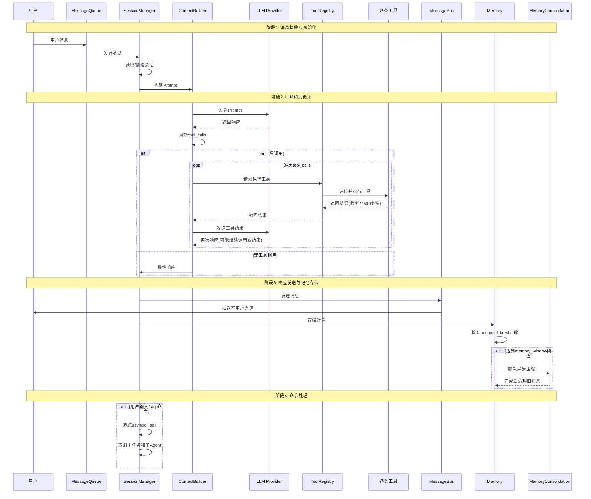
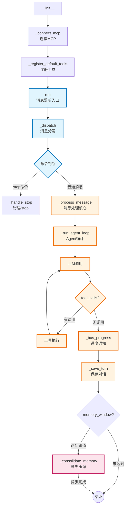
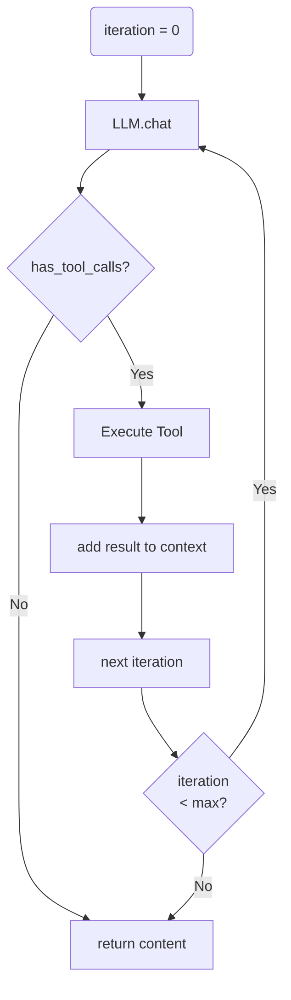

# Agent Loop 深入解析

> 本文档是 [LEARNING_PLAN.md](./LEARNING_PLAN.md) Day 2 的补充材料

## 概述

`agent/loop.py` 是 nanobot 的**核心处理引擎**（510行），负责：
1. 接收消息
2. 构建上下文（历史、记忆、技能）
3. 调用 LLM
4. 执行工具调用
5. 发送响应

```
用户消息 → AgentLoop → LLM + Tools → 响应
```

---

## 交互流程图



---


## 类：AgentLoop

### 初始化 (`__init__`)

```python
def __init__(
    self,
    bus: MessageBus,              # 消息总线
    provider: LLMProvider,        # LLM提供者
    workspace: Path,              # 工作目录
    model: str | None = None,    # 模型名称
    max_iterations: int = 40,   # 最大迭代次数
    temperature: float = 0.1,   # 温度参数
    max_tokens: int = 4096,      # 最大token数
    memory_window: int = 100,    # 记忆窗口大小
    reasoning_effort: str | None = None,  # 推理强度
    brave_api_key: str | None = None,      # Brave Search API
    web_proxy: str | None = None,          # 网页代理
    exec_config: ExecToolConfig | None = None,  # Shell配置
    cron_service: CronService | None = None,    # 定时任务服务
    restrict_to_workspace: bool = False,         # 限制工作目录
    session_manager: SessionManager | None = None, # 会话管理器
    mcp_servers: dict | None = None,              # MCP服务器配置
    channels_config: ChannelsConfig | None = None,# 频道配置
)
```

**核心依赖组件**：
| 组件 | 用途 |
|------|------|
| `bus` | 消息队列，收发消息 |
| `provider` | LLM 调用 |
| `workspace` | 工作目录（记忆、技能文件） |
| `context` | 构建 Prompt |
| `sessions` | 会话管理 |
| `tools` | 工具注册表 |
| `subagents` | 子Agent管理 |

**内部状态**：
```python
self._running = False              # 运行标志
self._mcp_stack = None             # MCP连接栈
self._consolidating: set[str]     # 正在整合的记忆会话
self._consolidation_tasks          # 整合任务集
self._consolidation_locks          # 整合锁（弱引用）
self._active_tasks: dict           # 活跃任务 {session_key: [tasks]}
self._processing_lock              # 全局处理锁
```

---

## 核心函数依赖关系



---

## 核心函数详解

### 1. `run()` - 主循环入口

```python
async def run(self) -> None:
    """Run the agent loop, dispatching messages as tasks to stay responsive to /stop."""
    self._running = True
    await self._connect_mcp()
    logger.info("Agent loop started")

    while self._running:
        try:
            msg = await asyncio.wait_for(self.bus.consume_inbound(), timeout=1.0)
        except asyncio.TimeoutError:
            continue

        if msg.content.strip().lower() == "/stop":
            await self._handle_stop(msg)
        else:
            # 异步分发，保持响应性
            task = asyncio.create_task(self._dispatch(msg))
            self._active_tasks.setdefault(msg.session_key, []).append(task)
            # 任务完成回调
            task.add_done_callback(...)
```

**关键设计**：
- 使用 `asyncio.wait_for` 实现 1 秒超时循环
- 每条消息创建独立 Task，支持 `/stop` 取消
- Task 按 session_key 追踪

---

### 2. `_dispatch()` - 消息分发

```python
async def _dispatch(self, msg: InboundMessage) -> None:
    """Process a message under the global lock."""
    async with self._processing_lock:  # 全局锁，防止并发
        try:
            response = await self._process_message(msg)
            if response is not None:
                await self.bus.publish_outbound(response)
        except asyncio.CancelledError:
            logger.info("Task cancelled for session {}", msg.session_key)
            raise
        except Exception:
            logger.exception("Error processing message for session {}", msg.session_key)
            await self.bus.publish_outbound(OutboundMessage(...))  # 错误响应
```

**关键设计**：
- `_processing_lock` 全局锁确保同一时刻只处理一条消息
- 捕获异常并返回友好错误信息

---

### 3. `_process_message()` - 单条消息处理

这是**最复杂的函数**（~120行），处理流程：

```python
async def _process_message(
    self,
    msg: InboundMessage,
    session_key: str | None = None,
    on_progress: Callable[[str], Awaitable[None]] | None = None,
) -> OutboundMessage | None:
```

**处理流程**：

```
1. System消息处理
   └─► 解析channel:chat_id
   └─► 特殊处理

2. Slash命令
   ├─► /new  - 立即整合记忆，开启新会话
   └─► /help - 显示帮助

3. 记忆整合触发
   └─► 如果 unconsolidated >= memory_window
   └─► 异步触发 _consolidate_memory()

4. 构建消息
   ├─► session.get_history(max_messages=memory_window)
   └─► context.build_messages(history, current_message, ...)

5. 运行Agent循环
   └─► _run_agent_loop(initial_messages, on_progress)

6. 保存会话
   ├─► _save_turn(session, all_msgs, ...)
   └─► sessions.save(session)

7. 返回响应
   └─► OutboundMessage
```

**关键逻辑**：

- **Memory Consolidation**（行396-412）：
  ```python
  unconsolidated = len(session.messages) - session.last_consolidated
  if (unconsolidated >= self.memory_window and session.key not in self._consolidating):
      # 异步触发记忆整合，不阻塞主流程
      _task = asyncio.create_task(_consolidate_and_unlock())
  ```

- **/new 命令**（行364-391）：立即触发记忆归档并清空会话

- **Message Tool 特殊处理**（行445-446）：如果 message 工具已发送消息，则不重复发送

---

### 4. `_run_agent_loop()` - 核心Agent循环

这是**最核心的函数**，实现 LLM ↔ Tool 的迭代：

```python
async def _run_agent_loop(
    self,
    initial_messages: list[dict],
    on_progress: Callable[..., Awaitable[None]] | None = None,
) -> tuple[str | None, list[str], list[dict]]:
    """Returns (final_content, tools_used, messages)."""
    messages = initial_messages
    iteration = 0
    final_content = None
    tools_used: list[str] = []

    while iteration < self.max_iterations:
        iteration += 1

        # 1. 调用 LLM
        response = await self.provider.chat(
            messages=messages,
            tools=self.tools.get_definitions(),
            model=self.model,
            temperature=self.temperature,
            max_tokens=self.max_tokens,
            reasoning_effort=self.reasoning_effort,
        )

        # 2. 有工具调用
        if response.has_tool_calls:
            # 发送进度（thinking + tool hint）
            if on_progress:
                clean = self._strip_think(response.content)
                if clean:
                    await on_progress(clean)
                await on_progress(self._tool_hint(response.tool_calls), tool_hint=True)

            # 添加助手消息（含tool_calls）
            messages = self.context.add_assistant_message(
                messages, response.content, tool_call_dicts,
                reasoning_content=response.reasoning_content,
                thinking_blocks=response.thinking_blocks,
            )

            # 3. 执行每个工具调用
            for tool_call in response.tool_calls:
                tools_used.append(tool_call.name)
                logger.info("Tool call: {}({})", tool_call.name, args_str[:200])
                result = await self.tools.execute(tool_call.name, tool_call.arguments)
                # 添加工具结果
                messages = self.context.add_tool_result(
                    messages, tool_call.id, tool_call.name, result
                )

        # 4. 无工具调用（最终响应）
        else:
            clean = self._strip_think(response.content)
            # 错误处理
            if response.finish_reason == "error":
                logger.error("LLM returned error: {}", (clean or "")[:200])
                final_content = clean or "Sorry, I encountered an error calling the AI model."
                break
            # 添加助手消息（纯文本）
            messages = self.context.add_assistant_message(
                messages, clean, reasoning_content=response.reasoning_content,
                thinking_blocks=response.thinking_blocks,
            )
            final_content = clean
            break

    # 5. 达到最大迭代次数
    if final_content is None and iteration >= self.max_iterations:
        final_content = "I reached the maximum number of tool call iterations..."

    return final_content, tools_used, messages
```

**迭代流程图**：



---

### 5. `_save_turn()` - 保存会话

```python
def _save_turn(self, session: Session, messages: list[dict], skip: int) -> None:
    """Save new-turn messages into session, truncating large tool results."""
    for m in messages[skip:]:
        entry = dict(m)
        role, content = entry.get("role"), entry.get("content")

        # 跳过空的assistant消息（会污染context）
        if role == "assistant" and not content and not entry.get("tool_calls"):
            continue

        # 截断过长的tool结果
        if role == "tool" and isinstance(content, str) and len(content) > self._TOOL_RESULT_MAX_CHARS:
            entry["content"] = content[:self._TOOL_RESULT_MAX_CHARS] + "\n... (truncated)"

        # 处理用户消息中的运行时上下文
        elif role == "user":
            if isinstance(content, str) and content.startswith(ContextBuilder._RUNTIME_CONTEXT_TAG):
                # 剥离运行时上下文前缀
                parts = content.split("\n\n", 1)
                if len(parts) > 1 and parts[1].strip():
                    entry["content"] = parts[1]
                else:
                    continue

        # 添加时间戳
        entry.setdefault("timestamp", datetime.now().isoformat())
        session.messages.append(entry)
```

**关键设计**：
- **Append-only**：只追加新消息，不修改历史
- **截断**：工具结果超过500字符截断（防止context溢出）
- **过滤**：剥离运行时上下文，移除空assistant消息

---

### 6. `_handle_stop()` - 停止任务

```python
async def _handle_stop(self, msg: InboundMessage) -> None:
    """Cancel all active tasks and subagents for the session."""
    tasks = self._active_tasks.pop(msg.session_key, [])
    cancelled = sum(1 for t in tasks if not t.done() and t.cancel())

    # 取消所有子agent
    sub_cancelled = await self.subagents.cancel_by_session(msg.session_key)

    total = cancelled + sub_cancelled
    content = f"⏹ Stopped {total} task(s)." if total else "No active task to stop."
    await self.bus.publish_outbound(OutboundMessage(...))
```

---

## 辅助函数

### `_strip_think()` - 移除think块
```python
@staticmethod
def _strip_think(text: str) -> str | None:
    """Remove <think>...</think> blocks that some models embed in content."""
    if not text:
        return None
    return re.sub(r"<think>[\s\S]*?
</think>

", "", text).strip() or None
```

### `_tool_hint()` - 工具调用提示
```python
@staticmethod
def _tool_hint(tool_calls: list) -> str:
    """Format tool calls as concise hint, e.g. 'web_search("query")'."""
    # 格式化: web_search("query..."), shell("ls -la...")
```

---

## 工具注册

```python
def _register_default_tools(self) -> None:
    """Register the default set of tools."""
    # 文件操作
    ReadFileTool, WriteFileTool, EditFileTool, ListDirTool
    # Shell执行
    ExecTool
    # 网页
    WebSearchTool, WebFetchTool
    # 消息发送
    MessageTool
    # 子Agent
    SpawnTool
    # 定时任务（CronTool 在 cron_service 中注册）
```

---

## 面试要点

1. **为什么用全局锁 `_processing_lock`？**
   > AgentLoop 中的全局 `_processing_lock` 防止并发消息处理期间的竞态条件，但允许跨不同会话的并行处理。这种设计选择在数据完整性和响应性之间取得了平衡，尽管它会对任何给定的对话线程的处理进行序列化

2. **Memory Consolidation 何时触发？**
   - `unconsolidated >= memory_window`（默认100条消息）
   - 异步执行，不阻塞主流程

3. **如何处理 `/stop` 命令？**
   - 通过 `asyncio.Task` 追踪活跃任务
   - 可以取消主任务和所有子agent

4. **为什么截断工具结果？**
   - 防止超过 LLM context 限制
   - 500字符是合理阈值

5. **迭代循环如何终止？**
   - LLM 无工具调用时
   - 达到 `max_iterations` 上限
   - LLM 返回错误

---

## 文件位置

- 源文件：`nanobot/agent/loop.py`
- 相关文件：
  - `nanobot/agent/context.py` - Prompt构建
  - `nanobot/agent/memory.py` - 记忆系统
  - `nanobot/agent/tools/registry.py` - 工具注册
  - `nanobot/session/manager.py` - 会话管理
  - `nanobot/bus/queue.py` - 消息队列
