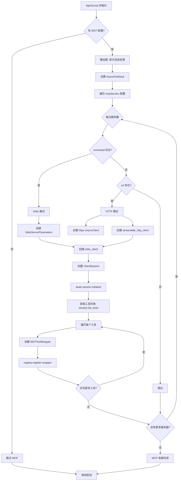

# Tool System 深入解析

> 本文档是 [LEARNING_PLAN.md](../../LEARNING_PLAN.md) Day 4 的补充材料

## 概述

nanobot 的 **Tool 系统** 是 Agent 与外部世界交互的桥梁，包含：
1. **Tool 抽象基类** - 统一的接口定义
2. **Tool Registry** - 工具注册和管理
3. **内置工具** - 文件操作、Shell 执行、网页搜索等

---

## 架构概览

```
┌─────────────────────────────────────────────────────────────────┐
│                        ToolRegistry                              │
│  ┌─────────────────────────────────────────────────────────┐   │
│  │ _tools: dict[str, Tool]                                 │   │
│  │  - read_file    → ReadFileTool                          │   │
│  │  - write_file   → WriteFileTool                         │   │
│  │  - edit_file    → EditFileTool                          │   │
│  │  - list_dir     → ListDirTool                           │   │
│  │  - exec         → ExecTool                              │   │
│  │  - web_search   → WebSearchTool                         │   │
│  │  - web_fetch    → WebFetchTool                          │   │
│  │  - message      → MessageTool                           │   │
│  │  - spawn        → SpawnTool                             │   │
│  └─────────────────────────────────────────────────────────┘   │
└─────────────────────────────────────────────────────────────────┘
                              │
                              ▼
┌─────────────────────────────────────────────────────────────────┐
│                           Tool (ABC)                             │
│  ┌───────────────┐  ┌───────────────┐  ┌───────────────────┐   │
│  │ name          │  │ description   │  │ parameters       │   │
│  │ (property)    │  │ (property)    │  │ (property)       │   │
│  └───────────────┘  └───────────────┘  └───────────────────┘   │
│  ┌───────────────────────────────────────────────────────────┐  │
│  │ execute(**kwargs) → str                                    │  │
│  │ (abstract method)                                          │  │
│  └───────────────────────────────────────────────────────────┘  │
│  ┌───────────────────────────────────────────────────────────┐  │
│  │ validate_params() → list[str]                              │  │
│  │ to_schema() → dict                                          │  │
│  └───────────────────────────────────────────────────────────┘  │
└─────────────────────────────────────────────────────────────────┘
```

---

## 1. Tool 基类 (base.py)

### 核心接口
- [Tool](../../nanobot/agent/tools/base.py)
- [Tool Registry](../../nanobot/agent/tools/registry.py)

```python
class Tool(ABC):
    """Abstract base class for agent tools."""

    @property
    @abstractmethod
    def name(self) -> str:
        """Tool name used in function calls."""
        pass

    @property
    @abstractmethod
    def description(self) -> str:
        """Description of what the tool does."""
        pass

    @property
    @abstractmethod
    def parameters(self) -> dict[str, Any]:
        """JSON Schema for tool parameters."""
        pass

    @abstractmethod
    async def execute(self, **kwargs: Any) -> str:
        """Execute the tool with given parameters."""
        pass
```

### 参数验证

```python
def validate_params(self, params: dict[str, Any]) -> list[str]:
    """Validate tool parameters against JSON schema. Returns error list."""
    schema = self.parameters or {}
    return self._validate(params, {**schema, "type": "object"}, "")
```

**支持的验证**：
- 类型检查 (string, integer, number, boolean, array, object)
- 枚举值 (enum)
- 数值范围 (minimum, maximum)
- 字符串长度 (minLength, maxLength)
- 必填字段 (required)
- 嵌套对象和数组

### 转换为 Schema

```python
def to_schema(self) -> dict[str, Any]:
    """Convert tool to OpenAI function schema format."""
    return {
        "type": "function",
        "function": {
            "name": self.name,
            "description": self.description,
            "parameters": self.parameters,
        },
    }
```

---

## 2. Tool Registry (registry.py)

### 核心功能

```python
class ToolRegistry:
    """Registry for agent tools. Allows dynamic registration and execution."""

    def __init__(self):
        self._tools: dict[str, Tool] = {}

    def register(self, tool: Tool) -> None:
        """Register a tool."""
        self._tools[tool.name] = tool

    def unregister(self, name: str) -> None:
        """Unregister a tool by name."""
        self._tools.pop(name, None)

    def get(self, name: str) -> Tool | None:
        """Get a tool by name."""
        return self._tools.get(name)

    def get_definitions(self) -> list[dict[str, Any]]:
        """Get all tool definitions in OpenAI format."""
        return [tool.to_schema() for tool in self._tools.values()]

    async def execute(self, name: str, params: dict[str, Any]) -> str:
        """Execute a tool by name with given parameters."""
        tool = self._tools.get(name)
        if not tool:
            return f"Error: Tool '{name}' not found. Available: {', '.join(self.tool_names)}"

        try:
            # 1. 参数验证
            errors = tool.validate_params(params)
            if errors:
                return f"Error: Invalid parameters for tool '{name}': " + "; ".join(errors)

            # 2. 执行
            result = await tool.execute(**params)

            # 3. 错误处理
            if isinstance(result, str) and result.startswith("Error"):
                return result + "\n\n[Analyze the error above and try a different approach.]"
            return result
        except Exception as e:
            return f"Error executing {name}: {str(e)}" + _HINT
```

---

## 3. 内置工具详解

### 3.1 文件操作工具 (filesystem.py)

#### ReadFileTool - 读取文件

```python
class ReadFileTool(Tool):
    @property
    def name(self) -> str:
        return "read_file"

    @property
    def parameters(self) -> dict:
        return {
            "type": "object",
            "properties": {"path": {"type": "string", "description": "The file path to read"}},
            "required": ["path"],
        }

    async def execute(self, path: str, **kwargs) -> str:
        file_path = _resolve_path(path, self._workspace, self._allowed_dir)
        if not file_path.exists():
            return f"Error: File not found: {path}"
        return file_path.read_text(encoding="utf-8")
```

#### WriteFileTool - 写入文件

```python
class WriteFileTool(Tool):
    async def execute(self, path: str, content: str, **kwargs) -> str:
        file_path = _resolve_path(path, self._workspace, self._allowed_dir)
        file_path.parent.mkdir(parents=True, exist_ok=True)
        file_path.write_text(content, encoding="utf-8")
        return f"Successfully wrote {len(content)} bytes to {file_path}"
```

#### EditFileTool - 编辑文件

```python
class EditFileTool(Tool):
    async def execute(self, path: str, old_text: str, new_text: str, **kwargs) -> str:
        content = file_path.read_text(encoding="utf-8")
        if old_text not in content:
            return self._not_found_message(old_text, content, path)
        new_content = content.replace(old_text, new_text, 1)
        file_path.write_text(new_content, encoding="utf-8")
        return f"Successfully edited {file_path}"
```

#### ListDirTool - 列出目录

```python
class ListDirTool(Tool):
    async def execute(self, path: str, **kwargs) -> str:
        dir_path = _resolve_path(path, self._workspace, self._allowed_dir)
        items = [f"{'📁 ' if item.is_dir() else '📄 '}{item.name}" for item in dir_path.iterdir()]
        return "\n".join(sorted(items))
```

**路径安全**：
```python
def _resolve_path(path: str, workspace: Path, allowed_dir: Path) -> Path:
    """Resolve path against workspace and enforce directory restriction."""
    p = Path(path).expanduser()
    if not p.is_absolute() and workspace:
        p = workspace / p
    resolved = p.resolve()
    if allowed_dir:
        resolved.relative_to(allowed_dir.resolve())  # 越界则抛异常
    return resolved
```

---

### 3.2 Shell 执行工具 (shell.py)

#### ExecTool - 执行Shell命令

```python
class ExecTool(Tool):
    """Tool to execute shell commands."""

    def __init__(
        self,
        timeout: int = 60,
        working_dir: str | None = None,
        deny_patterns: list[str] | None = None,
        restrict_to_workspace: bool = False,
    ):
        self.timeout = timeout
        self.deny_patterns = deny_patterns or [
            r"\brm\s+-[rf]{1,2}\b",          # rm -r, rm -rf
            r"\bdel\s+/[fq]\b",              # del /f, del /q
            r"\bformat\b",                    # format
            r"\b(mkfs|diskpart)\b",          # 磁盘操作
            r"\bdd\s+if=",                   # dd
            r"\b(shutdown|reboot|poweroff)\b",  # 系统电源
            r":\(\)\s*\{.*\};\s*:",          # fork bomb
        ]
        self.restrict_to_workspace = restrict_to_workspace

    async def execute(self, command: str, working_dir: str | None = None, **kwargs) -> str:
        # 1. 安全检查
        guard_error = self._guard_command(command, cwd)
        if guard_error:
            return guard_error

        # 2. 执行命令
        process = await asyncio.create_subprocess_shell(command, ...)
        stdout, stderr = await asyncio.wait_for(process.communicate(), timeout=self.timeout)

        # 3. 处理输出
        if process.returncode != 0:
            return f"{stdout}\nSTDERR:{stderr}\nExit code: {process.returncode}"
        return stdout or "(no output)"
```

**安全机制**：

1. **Deny Patterns** - 危险命令黑名单
   ```python
   r"\brm\s+-[rf]{1,2}\b"     # 禁止 rm -rf
   r"\bdel\s+/[fq]\b"         # 禁止 del /f
   r"\bformat\b"              # 禁止 format
   r"\b(shutdown|reboot)\b"   # 禁止关机
   ```

2. **Allow Patterns** - 白名单（可选）
   ```python
   allow_patterns = [r"^git", r"^npm", r"^pytest"]
   ```

3. **Workspace 限制** - 防止路径穿越
   ```python
   if self.restrict_to_workspace:
       if ".." in command:  # 检测 .. 路径穿越
           return "Error: path traversal detected"
       # 禁止访问 workspace 外的绝对路径
   ```

4. **超时控制** - 默认 60 秒

5. **输出截断** - 最大 10000 字符

---

### 3.3 网页工具 (web.py)

#### WebSearchTool - 网页搜索

```python
class WebSearchTool(Tool):
    name = "web_search"
    description = "Search the web. Returns titles, URLs, and snippets."

    async def execute(self, query: str, count: int | None = None, **kwargs) -> str:
        # 调用 Brave Search API
        # 返回搜索结果标题、URL 和摘要
```

**功能**：
- 使用 Brave Search API 进行网页搜索
- 返回标题、URL 和描述摘要
- 支持配置结果数量（1-10）

**配置**：
```json
{
  "tools": {
    "web": {
      "search": {
        "apiKey": "YOUR_BRAVE_API_KEY"
      }
    }
  }
}
```

#### WebFetchTool - 网页抓取

```python
class WebFetchTool(Tool):
    name = "web_fetch"
    description = "Fetch URL and extract readable content (HTML → markdown/text)."

    async def execute(self, url: str, extractMode: str = "markdown", maxChars: int | None = None):
        # 使用 Readability 提取网页正文
        # 支持 markdown/text 格式输出
        # 支持 maxChars 截断
```

**功能**：
- 使用 Readability 库提取网页正文
- 支持 Markdown 和纯文本两种输出格式
- 自动处理重定向（最多 5 次）
- 支持输出截断（默认 50000 字符）
- 自动处理 JSON/HTML/Raw 等多种内容类型

**安全机制**：
- URL 验证：仅允许 http/https 协议
- 限制重定向次数防止 DoS 攻击
- 使用固定 User-Agent 模拟浏览器

---

### 3.4 消息工具 (message.py)

#### MessageTool - 发送消息

```python
class MessageTool(Tool):
    """Tool to send messages to users on chat channels."""

    async def execute(
        self,
        content: str,
        channel: str | None = None,
        chat_id: str | None = None,
        message_id: str | None = None,
        media: list[str] | None = None,
    ) -> str:
        # 通过 MessageBus 发送消息到指定渠道
```

**功能**：
- 向用户发送消息到聊天渠道
- 支持指定目标 channel 和 chat_id
- 支持发送附件（图片、音频、文档）
- 支持回复特定消息（通过 message_id）

**参数**：
| 参数 | 类型 | 说明 |
|------|------|------|
| content | string | 消息内容（必需） |
| channel | string | 目标渠道（可选，默认当前渠道） |
| chat_id | string | 目标用户 ID（可选，默认当前用户） |
| media | array | 附件路径列表（可选） |

**使用场景**：
- 在 Tool 中主动通知用户
- 跨渠道发送消息
- 发送文件/图片给用户

---

### 3.5 子 Agent 工具 (spawn.py)

#### SpawnTool - 启动子 Agent

```python
class SpawnTool(Tool):
    """Tool to spawn a subagent for background task execution."""

    async def execute(self, task: str, label: str | None = None, **kwargs) -> str:
        return await self._manager.spawn(
            task=task,
            label=label,
            origin_channel=self._origin_channel,
            origin_chat_id=self._origin_chat_id,
            session_key=self._session_key,
        )
```

**功能**：
- 在后台启动子 Agent 执行任务
- 子 Agent 独立运行，不阻塞主对话
- 任务完成后通过消息通知用户

**参数**：
| 参数 | 类型 | 说明 |
|------|------|------|
| task | string | 子 Agent 需要完成的任务描述（必需） |
| label | string | 任务标签，便于识别（可选） |

**使用场景**：
- 耗时的搜索任务
- 批量文件处理
- 并行执行多个独立任务
- 不阻塞主对话的后台任务

**与主 Agent 的区别**：
- 独立的消息循环和工具调用
- 有独立的执行状态跟踪
- 可通过 `/stop` 命令取消

---

### 3.6 定时任务工具 (cron.py)

#### CronTool - 定时任务管理

```python
class CronTool(Tool):
    """Tool to schedule reminders and recurring tasks."""

    async def execute(
        self,
        action: str,
        message: str = "",
        every_seconds: int | None = None,
        cron_expr: str | None = None,
        tz: str | None = None,
        at: str | None = None,
        job_id: str | None = None,
    ) -> str:
        # 支持三种定时方式：every_seconds、cron_expr、at
```

**功能**：
- 定时提醒任务
- 周期性执行任务
- 一次性定时任务

**参数**：
| 参数 | 类型 | 说明 |
|------|------|------|
| action | string | 操作：add/list/remove（必需） |
| message | string | 提醒消息（add 时必需） |
| every_seconds | integer | 间隔秒数（周期性任务） |
| cron_expr | string | Cron 表达式（如 "0 9 * * *"） |
| tz | string | 时区（如 "America/Vancouver"） |
| at | string | 一次性执行时间（ISO 格式） |
| job_id | string | 任务 ID（remove 时必需） |

**定时方式**：

1. **every_seconds**：间隔执行
   ```
   每 300 秒执行一次
   every_seconds: 300
   ```

2. **cron_expr**：Cron 表达式
   ```
   每天早上 9 点执行
   cron_expr: "0 9 * * *"
   tz: "Asia/Shanghai"
   ```

3. **at**：一次性执行
   ```
   2026 年 2 月 12 日 10:30 执行
   at: "2026-02-12T10:30:00"
   ```

**操作示例**：
```
# 添加定时任务
cron(action="add", message="喝水提醒", every_seconds=3600)

# 列出所有任务
cron(action="list")

# 删除任务
cron(action="remove", job_id="job_xxx")
```

**安全机制**：
- 禁止在 cron job 内部创建新的 cron job
- 需要有效的 session context（channel/chat_id）

---

### 3.7 MCP 工具 (mcp.py)

#### MCP 集成概述

MCP (Model Context Protocol) 是 Anthropic 推出的模型上下文协议，允许 AI 助手连接外部工具服务器。nanobot 通过 `MCPToolWrapper` 将 MCP 工具转换为原生工具。

**MCP 加载流程**：



**流程说明**：

1. **懒加载**：MCP 服务器在首次消息处理时才连接（不是启动时）
2. **配置解析**：遍历 `config.json` 中的 `tools.mcpServers`
3. **连接方式**：
   - `command` + `args` → Stdio 模式（本地进程）
   - `url` → HTTP 模式（SSE）
4. **工具注册**：每个 MCP 工具封装为 `MCPToolWrapper` 注册到 `ToolRegistry`
5. **命名转换**：`mcp_{server_name}_{original_name}` 避免冲突

```python
class MCPToolWrapper(Tool):
    """Wraps a single MCP server tool as a nanobot Tool."""

    def __init__(self, session, server_name: str, tool_def, tool_timeout: int = 30):
        self._name = f"mcp_{server_name}_{tool_def.name}"
        self._description = tool_def.description
        self._parameters = tool_def.inputSchema
```

**MCP 连接方式**：

1. **Stdio 模式**（本地进程）
   ```json
   {
     "tools": {
       "mcpServers": {
         "filesystem": {
           "command": "npx",
           "args": ["-y", "@modelcontextprotocol/server-filesystem", "/path/to/dir"]
         }
       }
     }
   }
   ```

2. **HTTP 模式**（远程服务器）
   ```json
   {
     "tools": {
       "mcpServers": {
         "my-remote": {
           "url": "https://example.com/mcp/",
           "headers": {
             "Authorization": "Bearer xxxxx"
           }
         }
       }
     }
   }
   ```

**工具命名**：
- MCP 工具名称格式：`mcp_{server_name}_{original_name}`
- 例如：`mcp_filesystem_read_file`

**超时配置**：
```json
{
  "tools": {
    "mcpServers": {
      "my-server": {
        "url": "https://example.com/mcp/",
        "toolTimeout": 120
      }
    }
  }
}
```

**功能特点**：
- 自动发现和注册 MCP 服务器工具
- 支持自定义超时配置
- 支持 HTTP/Stdio 两种传输方式
- 支持自定义请求头（用于认证）

#### `connect_mcp_servers()` 函数详解

```python
async def connect_mcp_servers(
    mcp_servers: dict, registry: ToolRegistry, stack: AsyncExitStack
) -> None:
    """Connect to configured MCP servers and register their tools."""
```

**函数参数**：
| 参数 | 类型 | 说明 |
|------|------|------|
| mcp_servers | dict | MCP 服务器配置（从 config.json 读取） |
| registry | ToolRegistry | 工具注册表，用于注册 MCP 工具 |
| stack | AsyncExitStack | 异步上下文管理器，用于管理连接生命周期 |

**完整代码解析**：

```python
# 1. 遍历所有配置的 MCP 服务器
for name, cfg in mcp_servers.items():
    try:
        # 2. 判断连接模式
        if cfg.command:
            # === Stdio 模式（本地进程）===
            params = StdioServerParameters(
                command=cfg.command,  # 如 "npx"
                args=cfg.args,       # 如 ["-y", "@modelcontextprotocol/server-filesystem"]
                env=cfg.env or None  # 环境变量
            )
            # 创建 stdio 客户端并加入生命周期管理
            read, write = await stack.enter_async_context(stdio_client(params))

        elif cfg.url:
            # === HTTP 模式（远程服务器）===
            # 创建自定义 httpx 客户端（无超时，配合工具级超时）
            http_client = await stack.enter_async_context(
                httpx.AsyncClient(
                    headers=cfg.headers or None,   # 自定义请求头（如认证）
                    follow_redirects=True,        # 自动跟随重定向
                    timeout=None,                 # 无默认超时，由工具级控制
                )
            )
            # 创建 HTTP 客户端并加入生命周期管理
            read, write, _ = await stack.enter_async_context(
                streamable_http_client(cfg.url, http_client=http_client)
            )
        else:
            # 无有效配置，跳过
            logger.warning("MCP server '{}': no command or url configured, skipping", name)
            continue

        # 3. 创建 MCP ClientSession
        session = await stack.enter_async_context(ClientSession(read, write))

        # 4. 初始化会话（协议握手）
        await session.initialize()

        # 5. 获取服务器上的工具列表
        tools = await session.list_tools()

        # 6. 遍历每个工具，注册到 ToolRegistry
        for tool_def in tools.tools:
            # 创建工具包装器
            wrapper = MCPToolWrapper(
                session,                    # MCP 会话引用
                name,                      # 服务器名称
                tool_def,                  # 工具定义
                tool_timeout=cfg.tool_timeout  # 超时配置
            )
            # 注册到工具注册表
            registry.register(wrapper)

        logger.info("MCP server '{}': connected, {} tools registered", name, len(tools.tools))

    except Exception as e:
        logger.error("MCP server '{}': failed to connect: {}", name, e)
```

**关键设计点**：

1. **AsyncExitStack 管理生命周期**
   - 自动清理所有连接资源
   - 无论成功失败都能正确释放

2. **Stdio vs HTTP 模式**
   - Stdio：本地进程，通过 stdin/stdout 通信
   - HTTP：远程服务器，通过 SSE (Server-Sent Events) 通信

3. **HTTP 客户端超时处理**
   - httpx 默认 5s 超时会抢占工具级超时
   - 因此显式设置 `timeout=None`，由工具级 `toolTimeout` 控制

4. **异常处理**
   - 单个服务器失败不影响其他服务器
   - 失败记录日志，不中断整体流程

**MCPToolWrapper 执行流程**：

```python
async def execute(self, **kwargs: Any) -> str:
    # 1. 调用 MCP 工具，设置超时
    result = await asyncio.wait_for(
        self._session.call_tool(self._original_name, arguments=kwargs),
        timeout=self._tool_timeout
    )

    # 2. 处理返回结果
    parts = []
    for block in result.content:
        if isinstance(block, types.TextContent):
            parts.append(block.text)
        else:
            parts.append(str(block))

    return "\n".join(parts) or "(no output)"
```

---

## 4. 工具注册流程

在 `AgentLoop` 初始化时：

```python
def _register_default_tools(self) -> None:
    """Register the default set of tools."""
    allowed_dir = self.workspace if self.restrict_to_workspace else None

    # 文件操作
    for cls in (ReadFileTool, WriteFileTool, EditFileTool, ListDirTool):
        self.tools.register(cls(workspace=self.workspace, allowed_dir=allowed_dir))

    # Shell 执行
    self.tools.register(ExecTool(
        working_dir=str(self.workspace),
        timeout=self.exec_config.timeout,
        restrict_to_workspace=self.restrict_to_workspace,
        path_append=self.exec_config.path_append,
    ))

    # 网页
    self.tools.register(WebSearchTool(api_key=self.brave_api_key, proxy=self.web_proxy))
    self.tools.register(WebFetchTool(proxy=self.web_proxy))

    # 消息发送
    self.tools.register(MessageTool(send_callback=self.bus.publish_outbound))

    # 子 Agent
    self.tools.register(SpawnTool(manager=self.subagents))
```

---

## 5. 面试要点

1. **为什么用 Tool 而不是直接执行？**
   - 可控性：参数验证、错误处理
   - 可观测性：记录工具调用
   - 安全性：安全检查、路径限制

2. **Tool 调用的完整流程？**
   - LLM 返回 tool_call
   - AgentLoop 执行 `tools.execute(name, params)`
   - 参数验证 → 执行 → 结果返回
   - 结果添加到 messages 继续循环

3. **如何保证工具执行安全？**
   - 路径限制（workspace 边界）
   - 命令黑名单（危险命令）
   - 超时控制
   - 输出截断

4. **为什么参数验证自定义实现？**
   - 轻量级，不需要引入 jsonschema 依赖
   - 足够满足基本需求

5. **Tool 和 MCP 的区别？**
   - Tool：内置功能，直接执行
   - MCP：外部服务代理，通过协议调用远程工具

6. **内置工具的命名空间冲突如何处理？**
   - MCP 工具名称格式：`mcp_{server_name}_{original_name}`
   - 例如：`mcp_filesystem_read_file`
   - 通过前缀避免与内置工具冲突

7. **WebFetch 如何提取网页正文？**
   - 使用 Mozilla 的 Readability 库
   - 自动提取标题、正文、作者等信息
   - 支持转换为 Markdown 或纯文本
   - 处理 JSON/HTML/Raw 等多种内容类型

8. **定时任务的三种触发方式？**
   - **every_seconds**：固定间隔（如每 3600 秒）
   - **cron_expr**：标准 Cron 表达式（如 `0 9 * * *`）
   - **at**：ISO 格式时间戳（如 `2026-02-12T10:30:00`）

9. **SpawnTool 子 Agent 与主 Agent 的区别？**
   - 独立的消息循环和工具调用
   - 不阻塞主对话流程
   - 可通过 `/stop` 命令取消
   - 适用于耗时任务和并行处理

10. **MCP 支持哪两种传输模式？**
    - **Stdio**：通过标准输入输出与本地进程通信（适用于本地工具）
    - **HTTP**：通过 HTTP SSE 与远程服务器通信（适用于远程服务）

11. **工具执行结果如何截断？**
    - Shell 工具：最大 10000 字符
    - WebFetch：可通过 maxChars 参数控制（默认 50000）
    - 防止超长输出导致 LLM context 溢出

12. **为什么禁止在 Cron Job 中创建新的 Cron Job？**
    - 防止无限循环创建任务
    - 导致资源耗尽和服务崩溃
    - 通过 `_in_cron_context` 标记检测

13. **MessageTool 如何实现跨渠道发送？**
    - 支持指定 target channel 和 chat_id
    - 通过 MessageBus 的 publish_outbound 发送
    - 支持附件（图片、音频、文档）

14. **MCP 工具的超时如何配置？**
    - 默认 30 秒超时
    - 可通过 `toolTimeout` 配置覆盖
    - HTTP 模式使用无超时 httpx 客户端配合工具级超时

15. **工具参数验证支持哪些类型？**
    - 基本类型：string、integer、number、boolean
    - 复合类型：array、object
    - 约束：enum、minimum、maximum、minLength、maxLength、required

---

## 文件位置

- 源文件：
  - `nanobot/agent/tools/base.py` - Tool 基类
  - `nanobot/agent/tools/registry.py` - 工具注册表
  - `nanobot/agent/tools/filesystem.py` - 文件操作
  - `nanobot/agent/tools/shell.py` - Shell 执行
  - `nanobot/agent/tools/web.py` - 网页工具
  - `nanobot/agent/tools/message.py` - 消息工具
  - `nanobot/agent/tools/spawn.py` - 子 Agent
  - `nanobot/agent/tools/cron.py` - 定时任务
  - `nanobot/agent/tools/mcp.py` - MCP 集成
- 相关文件：
  - `nanobot/agent/loop.py` - 调用 ToolRegistry
