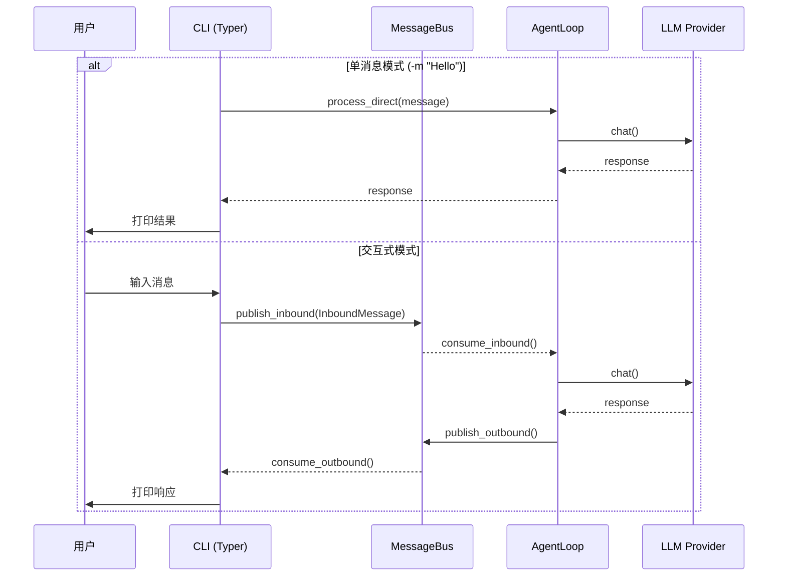
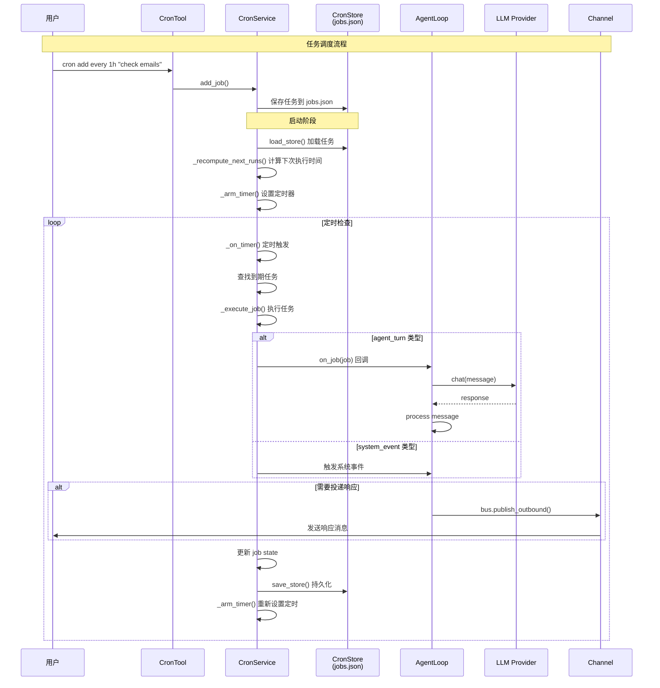
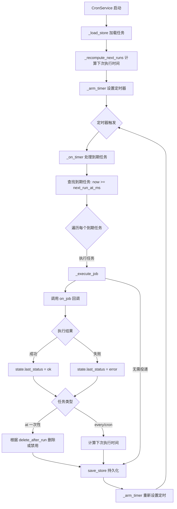
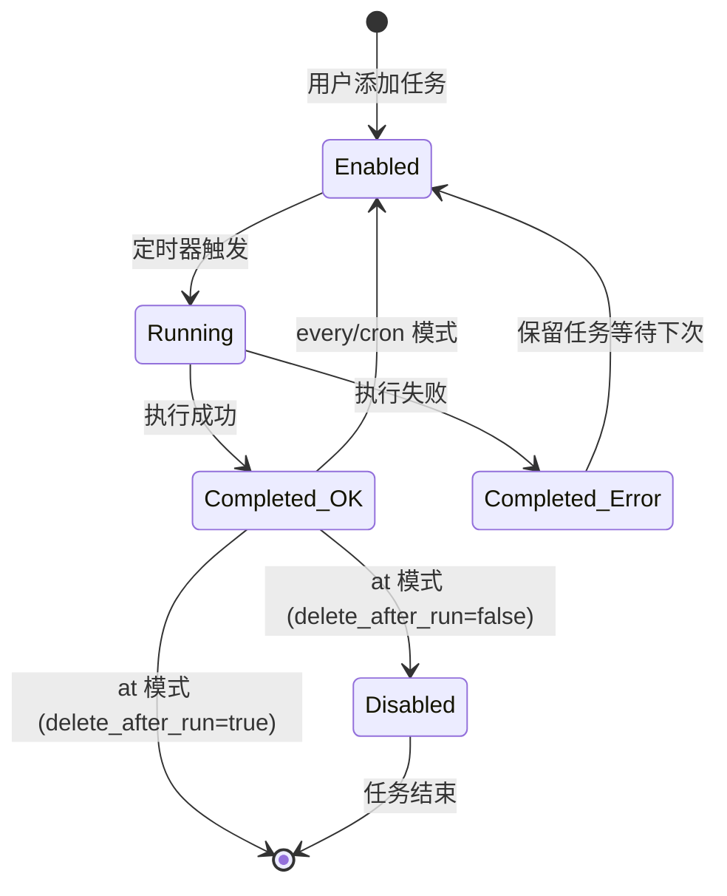
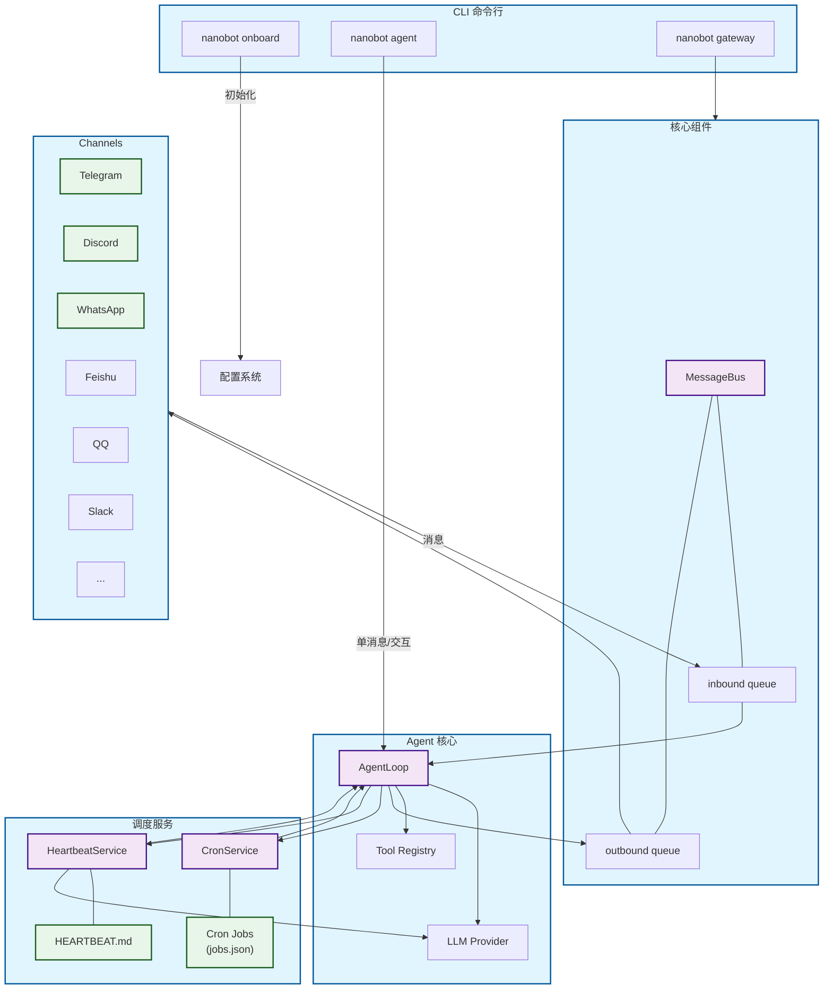
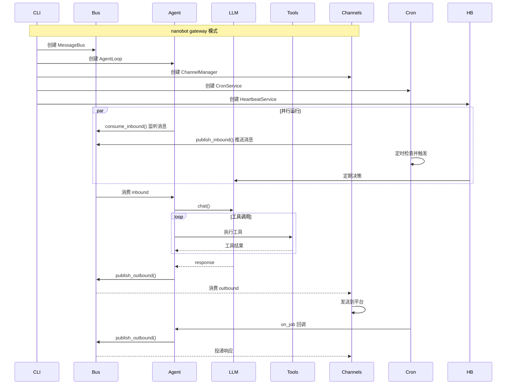

# CLI、Cron 与 Heartbeat 深入解析

> 本文档是 [LEARNING_PLAN.md](./LEARNING_PLAN.md) Day 7 的补充材料

## 概述

Day 7 涵盖 nanobot 的进阶功能：
1. **CLI 命令行界面** - 与 Agent 交互
2. **Cron 定时任务** - 定时执行任务
3. **Heartbeat 心跳服务** - 主动唤醒 Agent

---

## 1. CLI 命令行界面

### 核心命令

```bash
nanobot onboard          # 初始化配置和工作区
nanobot agent            # 交互式聊天模式
nanobot agent -m "Hello" # 单消息模式
nanobot gateway          # 启动 Gateway（所有 Channel）
nanobot status           # 显示状态
```

### 架构

```
CLI Commands (Typer)
    │
    ├── onboard()        → 初始化配置
    ├── agent()          → 交互式/单消息模式
    ├── gateway()        → 启动所有 Channel
    ├── status()         → 显示状态
    ├── channels status  → Channel 状态
    ├── channels login   → 登录 Channel
    └── provider login   → OAuth 登录
```

### Agent 模式

```python
@app.command()
def agent(
    message: str = typer.Option(None, "--message", "-m"),
    session_id: str = typer.Option("cli:direct", "--session", "-s"),
    markdown: bool = typer.Option(True, "--markdown/--no-markdown"),
    logs: bool = typer.Option(False, "--logs/--no-logs"),
):
```

**两种模式**：

1. **单消息模式** (`-m "Hello"`) - 直接调用，返回结果
2. **交互式模式** - REPL 循环，支持历史记录

#### 单消息模式流程

```python
if message:
    # Single message mode — direct call, no bus needed
    async def run_once():
        with _thinking_ctx():
            response = await agent_loop.process_direct(message, session_id, on_progress=_cli_progress)
        _print_agent_response(response, render_markdown=markdown)
        await agent_loop.close_mcp()

    asyncio.run(run_once())
```

#### 交互式模式流程

```python
else:
    # Interactive mode — route through bus like other channels
    async def run_interactive():
        # 1. 启动 AgentLoop 作为后台任务
        bus_task = asyncio.create_task(agent_loop.run())

        # 2. 启动出站消息消费任务
        outbound_task = asyncio.create_task(_consume_outbound())

        # 3. REPL 循环读取用户输入
        while True:
            user_input = await _read_interactive_input_async()
            # 发布到 MessageBus
            await bus.publish_inbound(InboundMessage(...))

    asyncio.run(run_interactive())
```

#### 完整 Agent 模式架构图



#### AgentLoop.process_direct vs run()

| 方法 | 用途 | 调用方式 |
|------|------|----------|
| `process_direct()` | CLI 单消息模式 | 直接调用，不走 Bus |
| `run()` | Gateway/交互模式 | 后台任务，持续监听 Bus |

```python
# process_direct - 单次调用
async def process_direct(
    self,
    message: str,
    session_id: str = "cli:direct",
    on_progress: Callable | None = None,
) -> OutboundMessage | None:
    """Process a single message directly, bypassing the bus."""
    msg = InboundMessage(
        channel="cli",
        sender_id="cli",
        chat_id=session_id,
        content=message,
    )
    return await self._process_message(msg, on_progress=on_progress)

# run - 持续监听
async def run(self) -> None:
    """Run the agent loop, dispatching messages as tasks."""
    self._running = True

    while self._running:
        msg = await asyncio.wait_for(self.bus.consume_inbound(), timeout=1.0)
        # 分发到 _process_message
        task = asyncio.create_task(self._dispatch(msg))
```

### Gateway 启动流程

```python
async def gateway(...):
    # 1. 加载配置
    config = load_config()

    # 2. 创建核心组件
    bus = MessageBus()
    provider = _make_provider(config)
    session_manager = SessionManager(workspace)

    # 3. 创建 Cron 服务
    cron = CronService(cron_store_path)

    # 4. 创建 Agent
    agent = AgentLoop(bus=bus, provider=provider, ...)

    # 5. 设置 Cron 回调
    cron.on_job = on_cron_job

    # 6. 创建 Heartbeat
    heartbeat = HeartbeatService(workspace=..., provider=provider, ...)

    # 7. 创建 Channel Manager
    channels = ChannelManager(config, bus)

    # 8. 启动所有服务
    await asyncio.gather(
        agent.run(),
        channels.start_all(),
    )
```

---

## 2. Cron 定时任务

### 核心概念

```
┌─────────────────────────────────────────────────────────────────┐
│                      CronService                                  │
│                                                                  │
│  支持三种调度模式：                                               │
│  1. at     — 一次性任务                                         │
│  2. every  — 间隔任务                                           │
│  3. cron   — Cron 表达式                                        │
└─────────────────────────────────────────────────────────────────┘
```

### CronJob 数据结构

```python
@dataclass
class CronSchedule:
    """Schedule definition for a cron job."""
    kind: Literal["at", "every", "cron"]
    at_ms: int | None = None           # 一次性任务的时间戳 (ms)
    every_ms: int | None = None        # 间隔任务的间隔 (ms)
    expr: str | None = None            # Cron 表达式 (如 "0 9 * * *")
    tz: str | None = None              # 时区

@dataclass
class CronPayload:
    """What to do when the job runs."""
    kind: Literal["system_event", "agent_turn"] = "agent_turn"
    message: str = ""                  # 发送给 Agent 的消息内容
    deliver: bool = False              # 是否将响应投递到渠道
    channel: str | None = None         # 投递目标渠道 (如 "telegram")
    to: str | None = None              # 投递目标 (如手机号)

@dataclass
class CronJobState:
    """Runtime state of a job."""
    next_run_at_ms: int | None = None  # 下次执行时间 (ms)
    last_run_at_ms: int | None = None  # 上次执行时间 (ms)
    last_status: Literal["ok", "error", "skipped"] | None = None  # 上次状态
    last_error: str | None = None      # 上次错误信息

@dataclass
class CronJob:
    """A scheduled job."""
    id: str                            # 任务 ID
    name: str                          # 任务名称
    enabled: bool = True               # 是否启用
    schedule: CronSchedule = field(default_factory=lambda: CronSchedule(kind="every"))
    payload: CronPayload = field(default_factory=CronPayload)
    state: CronJobState = field(default_factory=CronJobState)
    created_at_ms: int = 0             # 创建时间
    updated_at_ms: int = 0             # 更新时间
    delete_after_run: bool = False     # 执行后是否删除 (一次性任务)

@dataclass
class CronStore:
    """Persistent store for cron jobs."""
    version: int = 1
    jobs: list[CronJob] = field(default_factory=list)
```

#### 调度模式详解

| 模式 | kind | 参数 | 说明 |
|------|------|------|------|
| 一次性 | `at` | `at_ms` | 指定时间执行一次 |
| 间隔 | `every` | `every_ms` | 每隔固定时间执行 |
| Cron | `cron` | `expr`, `tz` | 标准 Cron 表达式 |

#### Payload 类型详解

| 类型 | 说明 |
|------|------|
| `agent_turn` | 作为用户消息发送给 Agent |
| `system_event` | 作为系统事件触发 |

### 使用方式

通过 `cron` 工具管理：

```python
# 添加定时任务
cron add every 1h "Reminder: check emails"

# 添加 cron 任务
cron add cron "0 9 * * *" "Morning summary"

# 列出任务
cron list

# 删除任务
cron delete <job_id>
```

### 定时任务流程图



### CronService 核心方法流程



### 执行 job 状态流转



### 实现原理

```python
class CronService:
    def __init__(self, store_path: Path, on_job: Callable | None = None):
        self.store_path = store_path
        self.on_job = on_job  # 回调函数

    async def start(self) -> None:
        """启动定时任务服务"""
        self._running = True
        self._timer_task = asyncio.create_task(self._run_loop())

    async def _run_loop(self) -> None:
        """主循环：检查并执行到期的任务"""
        while self._running:
            await asyncio.sleep(1)  # 每秒检查
            now = _now_ms()

            for job in self._get_due_jobs(now):
                if self.on_job:
                    asyncio.create_task(self.on_job(job))

    def _compute_next_run(self, schedule: CronSchedule, now_ms: int) -> int | None:
        """计算下次执行时间"""
        if schedule.kind == "at":
            return schedule.at_ms if schedule.at_ms > now_ms else None
        if schedule.kind == "every":
            return now_ms + schedule.every_ms
        if schedule.kind == "cron":
            # 使用 croniter 计算
            return croniter(schedule.expr, now).get_next()
```

---

## 3. Heartbeat 心跳服务

### 核心概念

Heartbeat 是 nanobot 的**主动唤醒机制**，让 Agent 定期检查是否有任务需要执行。

```
┌─────────────────────────────────────────────────────────────────┐
│                    HeartbeatService                              │
│                                                                  │
│  Phase 1 (决策): 读取 HEARTBEAT.md → LLM 决定 skip/run        │
│                                                                  │
│  Phase 2 (执行): 仅当 Phase 1 返回 "run" 时执行任务           │
└─────────────────────────────────────────────────────────────────┘
```

### HEARTBEAT.md 格式

```markdown
# Active Tasks

## Morning Review (9:00 AM)
- Check calendar for meetings
- Review pending PRs

## Hourly Checks
- Monitor CI pipeline status
- Check error logs
```

### 实现原理

```python
class HeartbeatService:
    def __init__(
        self,
        workspace: Path,
        provider: LLMProvider,
        model: str,
        on_execute: Callable | None = None,  # 执行回调
        on_notify: Callable | None = None,    # 通知回调
        interval_s: int = 30 * 60,          # 默认 30 分钟
        enabled: bool = True,
    ):
        ...

    async def start(self) -> None:
        """启动心跳服务"""
        self._running = True
        self._task = asyncio.create_task(self._run_loop())

    async def _tick(self) -> None:
        """单次心跳"""
        # 1. 读取 HEARTBEAT.md
        content = self._read_heartbeat_file()
        if not content:
            return

        # 2. Phase 1: 决策
        action, tasks = await self._decide(content)

        if action != "run":
            return  # 跳过

        # 3. Phase 2: 执行
        if self.on_execute:
            response = await self.on_execute(tasks)

            # 4. 通知用户
            if self.on_notify:
                await self.on_notify(response)

    async def _decide(self, content: str) -> tuple[str, str]:
        """让 LLM 决定是否执行任务"""
        response = await self.provider.chat(
            messages=[
                {"role": "system", "content": "You are a heartbeat agent..."},
                {"role": "user", "content": f"Review HEARTBEAT.md and decide:\n{content}"}
            ],
            tools=_HEARTBEAT_TOOL,  # heartbeat 工具
            model=self.model,
        )

        # 解析工具调用结果
        args = response.tool_calls[0].arguments
        return args.get("action", "skip"), args.get("tasks", "")
```

### heartbeat 工具

```python
_HEARTBEAT_TOOL = [
    {
        "type": "function",
        "function": {
            "name": "heartbeat",
            "description": "Report heartbeat decision after reviewing tasks.",
            "parameters": {
                "type": "object",
                "properties": {
                    "action": {
                        "type": "string",
                        "enum": ["skip", "run"],
                    },
                    "tasks": {
                        "type": "string",
                        "description": "Summary of active tasks (required for run)",
                    },
                },
                "required": ["action"],
            },
        },
    }
]
```

---

## 整体架构



### 组件说明

| 组件 | 说明 |
|------|------|
| CLI | 命令行入口，支持 onboard/agent/gateway |
| MessageBus | 消息队列，解耦 Channel 和 Agent |
| AgentLoop | 核心处理引擎 |
| LLM Provider | 模型调用（OpenAI/Anthropic/DeepSeek...） |
| Tool Registry | 工具注册（shell/filesystem/web/mcp...） |
| Channels | 平台接入（Telegram/Discord/WhatsApp...） |
| CronService | 定时任务服务 |
| HeartbeatService | 心跳主动唤醒服务 |

### 数据流



---

## 面试要点

1. **CLI 两种模式的区别？**
   - 单消息：直接调用 `process_direct()`
   - 交互式：通过 MessageBus 路由

2. **Cron 的三种调度模式？**
   - `at`: 一次性任务
   - `every`: 间隔任务
   - `cron`: Cron 表达式

3. **Heartbeat 的两阶段设计？**
   - Phase 1: LLM 决策（通过工具调用）
   - Phase 2: 仅当决策为 "run" 时执行

4. **为什么用工具调用而不是自由文本？**
   - 确定性：避免解析错误
   - 结构化：action + tasks 清晰

5. **Gateway 启动流程？**
   - 创建组件 → 设置回调 → 启动服务 → asyncio.gather

---

## 文件位置

- 源文件：
  - `nanobot/cli/commands.py` - CLI 命令
  - `nanobot/cron/service.py` - Cron 服务
  - `nanobot/cron/types.py` - Cron 数据类型
  - `nanobot/heartbeat/service.py` - Heartbeat 服务
- 相关文件：
  - `nanobot/agent/loop.py` - AgentLoop
  - `nanobot/channels/manager.py` - ChannelManager
  - `nanobot/bus/queue.py` - MessageBus
