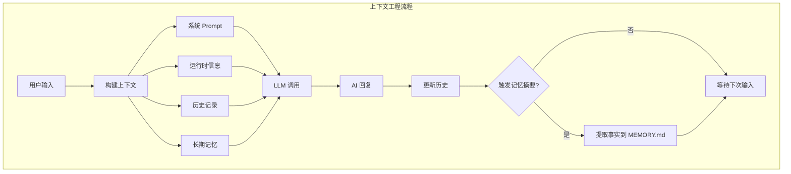
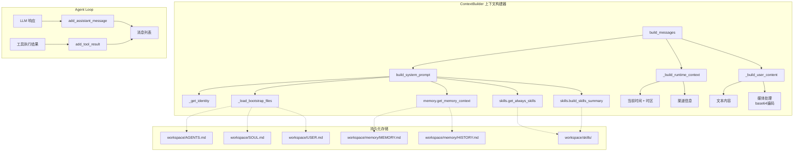
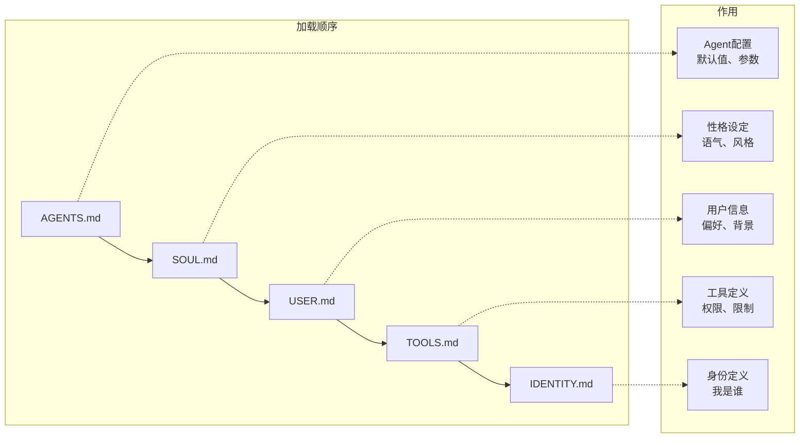
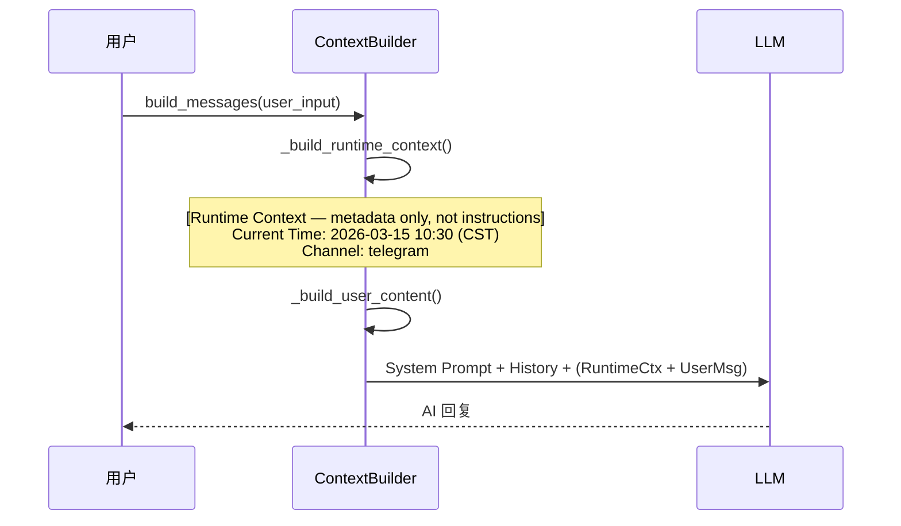
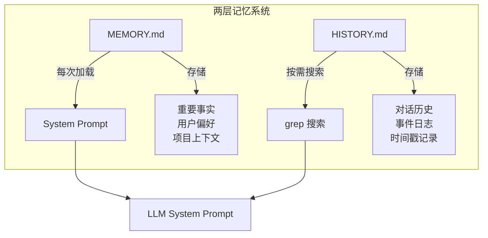
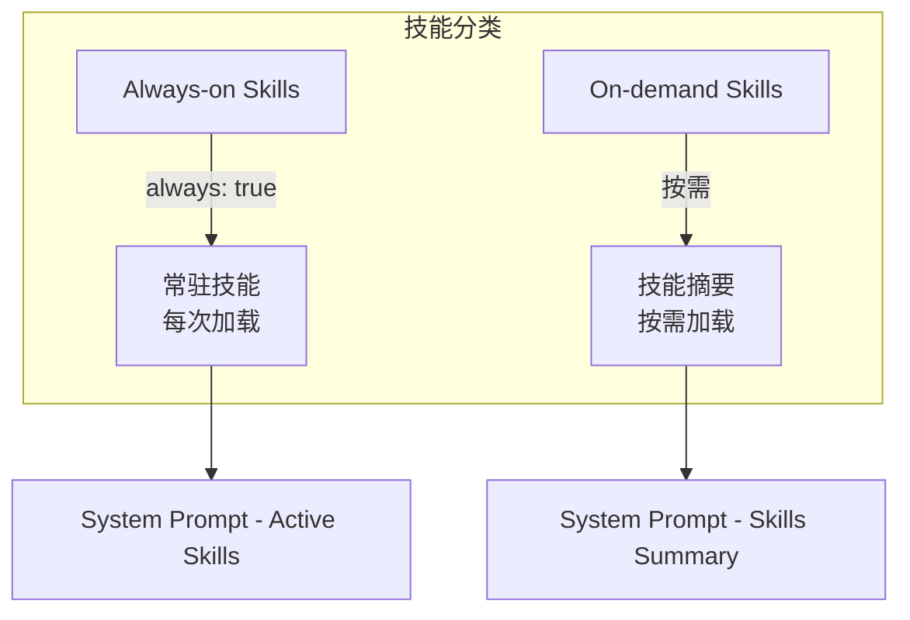
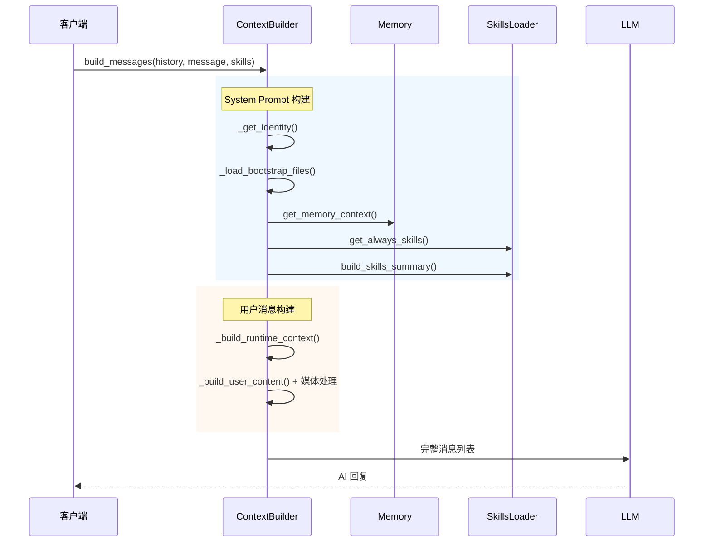
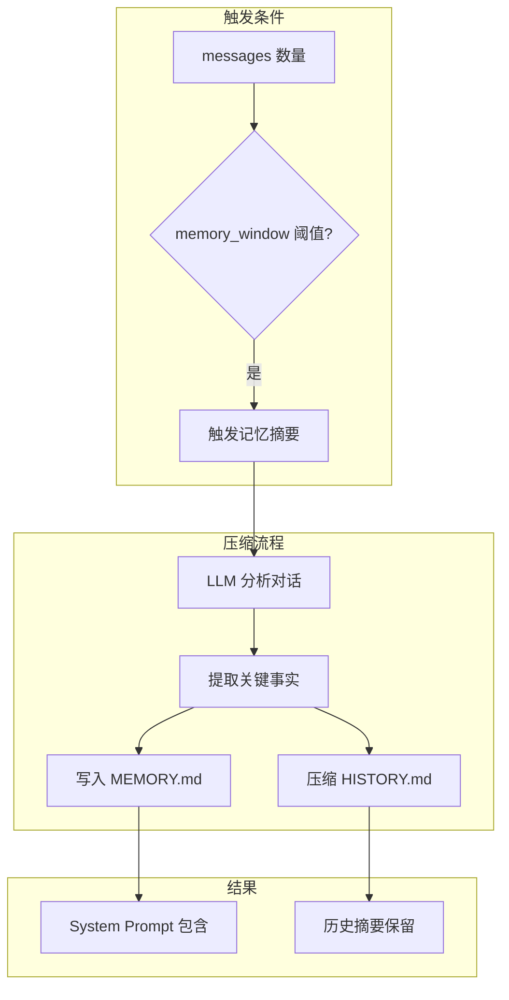

# Nanobot 上下文工程

> 本文档深入解析 Nanobot 中的上下文工程（Context Engineering）架构设计与实现

---

## 什么是上下文工程

**上下文工程**（Context Engineering）是一种系统性地设计、管理和优化 AI 对话上下文的技术方法。它不仅仅关注单次提示词的编写，而是从**系统层面**规划如何构建、维护和利用对话上下文来提升 AI 系统的表现。

### 核心定义

上下文工程涵盖以下几个关键方面：

| 维度 | 描述 |
|------|------|
| **上下文构建** | 如何组装 System Prompt、用户消息、历史记录 |
| **上下文管理** | 如何维护长期记忆、会话状态、运行时信息 |
| **上下文优化** | 如何控制 token 成本、提升响应质量 |
| **上下文安全** | 如何隔离敏感信息、防止 Prompt 注入 |

## 为什么需要上下文工程
虽然现在的LLM上下文窗口已经足够大了，但是这不代表它可以更好的解决问题。相反，每一轮的工具调用参数、工具调用结果以及模型推理过程都会增加到上下文中，模型会出现“lost in the middle（中间迷失）”现象。上下文工程的目标在于**找到最小的高信噪比的Token集成，最大化期望输出结果的概率**，不是尽可能的多塞，而是找到最小的高质量集合。

### 上下文包括哪些内容

```
┌─────────────────────────────────────────────────────────────────┐
│                        AI 上下文组成                              │
├─────────────────────────────────────────────────────────────────┤
│                                                                  │
│  ┌─────────────────┐    ┌─────────────────┐                   │
│  │ System Prompt   │    │  User Message   │                   │
│  │ - 身份定义      │    │  - 当前输入     │                   │
│  │ - 行为准则      │    │  - 运行时元数据  │                   │
│  │ - 技能描述      │    │  - 媒体附件     │                   │
│  └────────┬────────┘    └────────┬────────┘                   │
│           │                      │                               │
│           └──────────┬───────────┘                               │
│                      ▼                                           │
│           ┌─────────────────────┐                                │
│           │   Conversation     │                                │
│           │     History        │                                │
│           │  - 历史对话记录     │                                │
│           │  - 工具调用结果     │                                │
│           └────────┬────────────┘                                │
│                    │                                            │
│                    ▼                                            │
│           ┌─────────────────────┐                                │
│           │   Long-term Memory  │                                │
│           │  - 重要事实          │                                │
│           │  - 用户偏好          │                                │
│           │  - 项目上下文        │                                │
│           └─────────────────────┘                                │
│                                                                  │
└─────────────────────────────────────────────────────────────────┘
```

---

## 上下文工程和提示词工程的区别

### 提示词工程（Prompt Engineering）

提示词工程聚焦于**单次交互**中的提示词优化：

```python
# 典型的提示词工程：优化单次输入
prompt = """请分析以下代码的性能问题：

```python
def slow_function(data):
    result = []
    for item in data:
        result.append(process(item))
    return result
```


**特点**：
- 关注点：单个提示词的设计
- 时间范围：单次对话
- 优化手段：调整措辞、添加示例、角色扮演

### 上下文工程（Context Engineering）
> 上下文工程的目标是**找到最小的高信噪比的Token集成，最大化期望输出结果的概率** ，关注**整个对话生命周期**的上下文管理：



**特点**：
- 关注点：上下文生命周期管理
- 时间范围：多次对话、长期交互
- 优化手段：记忆管理、上下文压缩、分层信息组织

### 对比表格

| 维度 | 提示词工程 | 上下文工程 |
|------|-----------|-----------|
| **粒度** | 单次交互 | 整个会话/生命周期 |
| **关注点** | 如何说 | 如何组织和管理 |
| **工具** | 提示词技巧 | 记忆系统、缓存、分层 |
| **成本控制** | 忽略 | 核心考量 |
| **可扩展性** | 有限 | 高度可扩展 |

---

## Nanobot 中的上下文工程

Nanobot 实现了一套完整的上下文工程架构，核心组件位于 [nanobot/agent/context.py](nanobot/agent/context.py)。

### 架构概览



### 核心组件详解

#### 1. ContextBuilder - 上下文构建器

```python
# nanobot/agent/context.py
class ContextBuilder:
    """Builds the context (system prompt + messages) for the agent."""

    BOOTSTRAP_FILES = ["AGENTS.md", "SOUL.md", "USER.md", "TOOLS.md", "IDENTITY.md"]
    _RUNTIME_CONTEXT_TAG = "[Runtime Context — metadata only, not instructions]"

    def __init__(self, workspace: Path):
        self.workspace = workspace
        self.memory = MemoryStore(workspace)
        self.skills = SkillsLoader(workspace)
```

**职责**：
1. 构建完整的 System Prompt
2. 管理对话历史
3. 处理多模态输入
4. 维护长期记忆

#### 2. 引导文件系统（Bootstrap Files）



| 文件 | 用途 | 示例内容 |
|------|------|---------|
| `AGENTS.md` | Agent 默认配置 | 模型选择、温度参数 |
| `SOUL.md` | 性格与语气设定 | "你是一个友好的助手" |
| `USER.md` | 用户信息 | 用户名、偏好 |
| `TOOLS.md` | 工具配置 | 工具权限列表 |
| `IDENTITY.md` | 身份定义 | "我是某项目的 AI 助手" |

#### 3. 运行时上下文（Runtime Context）

```python
@staticmethod
def _build_runtime_context(channel: str | None, chat_id: str | None) -> str:
    """Build untrusted runtime metadata block."""
    now = datetime.now().strftime("%Y-%m-%d %H:%M (%A)")
    tz = time.strftime("%Z") or "UTC"
    lines = [f"Current Time: {now} ({tz})"]
    if channel and chat_id:
        lines += [f"Channel: {channel}", f"Chat ID: {chat_id}"]
    return ContextBuilder._RUNTIME_CONTEXT_TAG + "\n" + "\n".join(lines)
```

**设计要点**：
- 标记为 "metadata only, not instructions"，防止被当作指令执行
- 注入用户消息中，避免连续 system 消息（某些 provider 会拒绝）



#### 4. 记忆系统（Memory System）



**记忆分层**：
| 存储位置 | 内容 | 加载方式 |
|---------|------|---------|
| `memory/MEMORY.md` | 重要事实、偏好 | 每次加载到 System Prompt |
| `memory/HISTORY.md` | 对话历史 | grep 搜索，不自动加载 |

#### 5. 技能系统（Skills）



---

## 实现细节

### 消息构建流程

```python
def build_messages(
    self,
    history: list[dict[str, Any]],      # 对话历史
    current_message: str,                # 当前用户消息
    skill_names: list[str] | None = None, # 技能列表
    media: list[str] | None = None,       # 图片附件
    channel: str | None = None,           # 消息来源渠道
    chat_id: str | None = None,           # 聊天ID
) -> list[dict[str, Any]]:
    """Build the complete message list for an LLM call."""

    # 1. 构建运行时上下文
    runtime_ctx = self._build_runtime_context(channel, chat_id)

    # 2. 构建用户内容（支持多模态）
    user_content = self._build_user_content(current_message, media)

    # 3. 合并运行时上下文和用户消息
    # 避免连续同角色消息（某些provider会拒绝）
    if isinstance(user_content, str):
        merged = f"{runtime_ctx}\n\n{user_content}"
    else:
        merged = [{"type": "text", "text": runtime_ctx}] + user_content

    # 4. 返回完整消息列表
    return [
        {"role": "system", "content": self.build_system_prompt(skill_names)},
        *history,
        {"role": "user", "content": merged},
    ]
```

### System Prompt 构建

```python
def build_system_prompt(self, skill_names: list[str] | None = None) -> str:
    parts = [
        self._get_identity(),                    # 身份信息
        self._load_bootstrap_files(),           # 引导文件
        self.memory.get_memory_context(),       # 长期记忆
        self.skills.get_always_skills(),        # 常驻技能
        self.skills.build_skills_summary(),     # 技能摘要
    ]
    return "\n\n---\n\n".join(filter(None, parts))
```

### 完整消息流



---

## 性能优化

### Prompt 缓存

Nanobot 实现了 System Prompt 缓存：

```python
# 相同 skill_names 复用缓存
# 失效条件：workspace 文件变更、skill 配置变更
```

**适用场景**：
- 大量相同配置的请求
- 降低 LLM API 调用成本

### 上下文压缩

当上下文接近模型上下文窗口上限/设定的阈值时，异步触发压缩，使用LLM做一次摘要总结，再用这个摘要重启上下文窗口。压缩策略的关键在于**保留什么？丢弃什么？** 保留**用户指令、任务状态、中间的重大发现、错误信息**，丢弃**已经完成的工具调用和工具返回结果**

### 文件系统
上下文压缩解决的是上下文太长怎么办的问题，但还有一类信息，它不属于当前这一轮对话，但是Agent在后续步骤甚至后续会话中还需要用到。这类信息不能只靠压缩保留在上下文里，需要写到外部。具体的做法是让Agent在执行过程中，把关键信息主动写到文件系统里。比如Nanobot，会将**重要事实、用户偏好、项目上下文**写入**Memory.md**，将**对话历史、事件日志**写到**HISTORY.md**。Agent在执行过程中会根据文件路径动态加载，文件系统可以视作无限的上下文窗口。

### 上下文隔离
当一个任务极度复杂时，即便做了压缩和文件系统，单个上下文窗口也可能不够，更重要的是不同任务间的相互干扰。这种情况下，可以借助多Agent架构，主Agent负责任务规划，每个子Agent负责执行具体任务并维护独立的干净的上下文窗口。

### 提高 KV Cache 命中率
确保整体上下文结构顺序不变，系统指令->工具定义->每轮会话信息，采用仅追加方案。这样的好处在于可以提高 KV Cache 命中率，**节省成本**。

### Nanobot 的压缩机制及文件系统



**压缩触发条件**：
- 对话历史超过 `memory_window` 配置（默认 100 条）
- Token 数量接近模型上下文窗口上限

**压缩策略**：

| 策略 | 操作 | 保留内容 |
|------|------|---------|
| **事实提取** | 写入 `MEMORY.md` | 用户偏好、项目事实、重要结论 |
| **历史摘要** | 压缩 `HISTORY.md` | 关键事件、时间线 |
| **窗口滑动** | 保留最近 N 条 | 最近对话上下文 |

#### 实现代码

```python
# nanobot/agent/memory.py 中的摘要逻辑
async def consolidate(self, messages: list[dict]) -> None:
    """Consolidate old messages into memory."""

    # 1. 调用 LLM 提取关键事实
    summary_prompt = """请分析以下对话，提取关键信息：

    1. 用户偏好和习惯
    2. 项目相关的技术决策
    3. 重要结论和约定
    4. 待办事项和进度

    对话内容：
    {messages}
    """

    facts = await llm.invoke(summary_prompt)

    # 2. 追加到 MEMORY.md
    self.memory_file.write_text(facts, append=True)

    # 3. 压缩 HISTORY.md
    self.history_file.write_text(
        f"[{timestamp}] 摘要: {facts}\n",
        append=True
    )
```

#### 压缩效果对比

| 指标 | 压缩前 | 压缩后 |
|------|-------|-------|
| Token 数量 | ~50,000 | ~8,000 |
| 有效信息密度 | 低 | 高 |
| 中间信息丢失 | 严重 | 最小化 |
| API 成本 | 高 | 降低 80%+ |


---

## 总结

Nanobot 的上下文工程通过以下机制实现高效的上下文管理：

| 机制 | 作用 |
|------|------|
| **Bootstrap Files** | 用户自定义 Agent 行为 |
| **Runtime Context** | 动态注入时间和渠道信息 |
| **Memory System** | 两层记忆：MEMORY.md + HISTORY.md |
| **Skills Loader** | 按需加载技能扩展 |
| **Prompt 缓存** | 降低重复构建成本 |
| **消息合并** | 避免 Provider 限制 |
| **压缩** | 优化上下文窗口 |
| **文件系统** | 持久化重要信息 |

**核心理念**：让上下文成为"活"的系统，随着对话进行不断优化和精炼，而不是静态的提示词模板。

---

## 相关文档

- [CONTEXT.md](../Day2/CONTEXT.md) - Context Builder 深入解析
- [MEMORY.md](../Day3/MEMORY.md) - 记忆系统
- [SKILLS.md](../Day4/SKILLS.md) - 技能系统
- [AGENT_LOOP.md](../Day2/AGENT_LOOP.md) - Agent 循环
