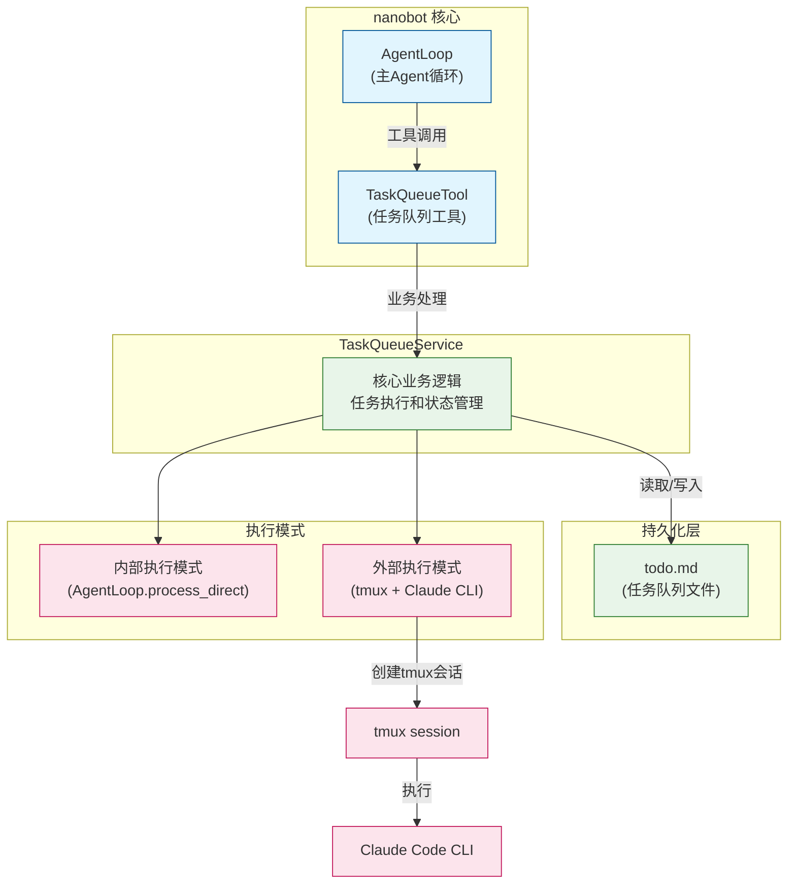
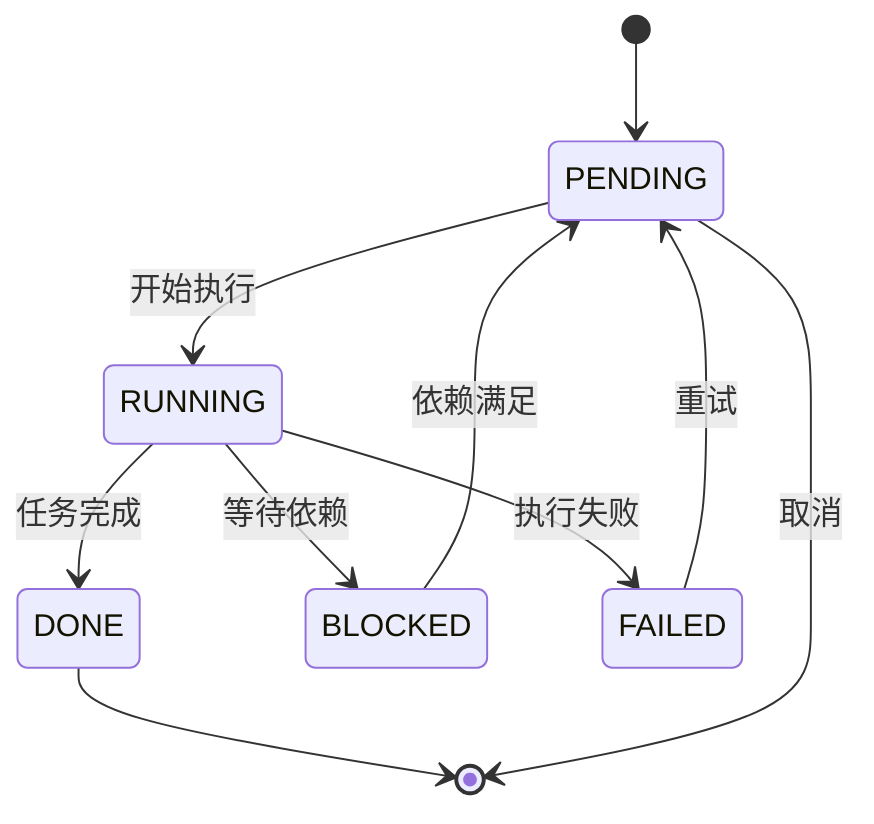
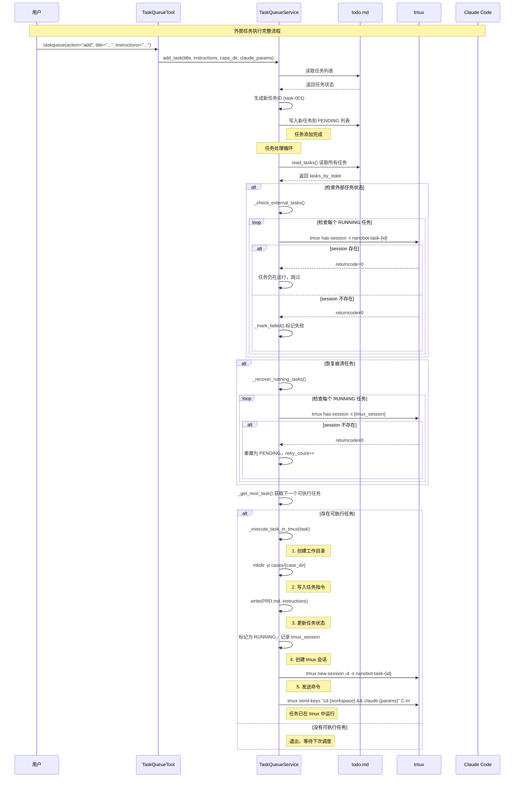

# Nanobot 集成 Claude Code 教学文档

本文档详细介绍如何将 Claude Code 集成到 nanobot 自管理 AI 系统中。

## 一、整体框架

### 1.1 架构概览



### 1.2 核心组件

| 组件 | 文件路径 | 职责 |
|------|----------|------|
| TaskQueueTool | `nanobot/agent/tools/taskqueue.py` | 对外暴露的工具接口，处理用户请求 |
| TaskQueueService | `nanobot/taskqueue/service.py` | 核心业务逻辑，任务执行和状态管理 |
| TaskQueueStorage | `nanobot/taskqueue/storage.py` | 任务持久化（todo.md） |
| Task | `nanobot/taskqueue/types.py` | 任务数据模型 |

### 1.3 任务状态流转



### 1.4 外部执行流程（核心）



---

## 二、设计步骤

### 2.1 环境准备

1. **安装 tmux**（外部执行模式必需）
   ```bash
   # Ubuntu/Debian
   sudo apt install tmux

   # macOS
   brew install tmux
   ```

2. **配置 Claude Code**
   ```bash
   # 确保 claude 命令可用
   claude --version
   ```

### 2.2 任务队列初始化

TaskQueueTool 会在 workspace 目录下创建 `todo.md` 文件：

```markdown
# Tasks

## PENDING

## RUNNING

## DONE

## BLOCKED

## FAILED
```

### 2.3 添加工具到 Agent

在 agent 初始化时注册 TaskQueueTool：

```python
from nanobot.agent.tools.taskqueue import TaskQueueTool
from nanobot.taskqueue.service import TaskQueueService

# 方式1：通过 service 实例（推荐）
service = TaskQueueService(
    workspace=Path("./workspace"),
    agent=agent_loop,
    use_external=True,  # 使用外部 Claude 执行
)
tool = TaskQueueTool(workspace=Path("./workspace"), service=service)

# 方式2：自动创建 service
tool = TaskQueueTool(workspace=Path("./workspace"))
```


### 2.4 任务执行命令

| 操作 | 命令示例 |
|------|----------|
| 添加任务 | `taskqueue(action="add", title="开发功能X", instructions="请实现...")` |
| 列出任务 | `taskqueue(action="list")` |
| 查看任务 | `taskqueue(action="get", task_id="task-001")` |
| 更新状态 | `taskqueue(action="update", task_id="task-001", state="DONE")` |
| 连接会话 | `taskqueue(action="attach", task_id="task-001")` |

---

## 三、代码实现详解

### 3.1 TaskQueueTool 工具接口实现

TaskQueueTool 是 nanobot 工具系统的实现，继承自 `Tool` 基类，负责对外暴露任务队列的操作接口。

#### 3.1.1 类结构

```python
# nanobot/agent/tools/taskqueue.py
class TaskQueueTool(Tool):
    """Tool to manage task queue for self-managing AI system."""

    def __init__(self, workspace: Path, service: TaskQueueService | None = None):
        self._workspace = workspace          # 工作目录路径
        self._service = service              # 服务实例（可选）
        self._channel = ""                   # 当前 channel
        self._chat_id = ""                   # 当前 chat_id
```

#### 3.1.2 核心方法

| 方法 | 职责 |
|------|------|
| `set_context(channel, chat_id)` | 设置会话上下文，用于结果投递 |
| `_get_service()` | 懒加载创建 TaskQueueService |
| `execute(action, ...)` | 执行工具操作（add/list/get/update/attach） |

#### 3.1.3 工具参数定义

```python
@property
def parameters(self) -> dict[str, Any]:
    return {
        "type": "object",
        "properties": {
            "action": {
                "type": "string",
                "enum": ["add", "list", "get", "update", "attach"],
                "description": "Action to perform",
            },
            "title": {"type": "string", "description": "Task title (for add)"},
            "instructions": {"type": "string", "description": "Task instructions (for add)"},
            "priority": {
                "type": "string",
                "enum": ["low", "normal", "high"],
                "default": "normal",
            },
            "case_dir": {
                "type": "string",
                "description": "Case directory name, e.g. 'case1'. Creates cases/{case_dir}",
            },
            "claude_params": {
                "type": "string",
                "default": "--dangerously-skip-permissions",
            },
            "state": {"type": "string", "enum": ["PENDING", "RUNNING", "DONE", "BLOCKED", "FAILED"]},
            "task_id": {"type": "string"},
            "error": {"type": "string"},
        },
        "required": ["action"],
    }
```

#### 3.1.4 安全检查实现

在添加任务时，会检查危险参数：

```python
async def execute(self, action: str, ...) -> str:
    if action == "add":
        # 检查危险参数
        if "--dangerously-skip-permissions" in claude_params:
            if os.geteuid() == 0:  # 检测 root 用户
                return "⚠️  安全风险警告：..."
```

---

### 3.2 TaskQueueService 核心服务实现

TaskQueueService 是任务队列的核心引擎，负责任务的调度、执行和状态管理。

#### 3.2.1 类初始化

```python
class TaskQueueService:
    MAX_RETRIES = 3                      # 最大重试次数
    TMUX_SESSION_PREFIX = "nanobot-task-"  # tmux 会话前缀

    def __init__(
        self,
        workspace: Path,
        agent: "AgentLoop",
        todo_filename: str = "todo.md",
        on_result: TaskResultCallback | None = None,
        use_external: bool = True,        # 默认使用外部 Claude 实例
    ):
        self.workspace = workspace
        self.agent = agent
        self.todo_file = workspace / todo_filename
        self.storage = TaskQueueStorage(self.todo_file)
        self._on_result = on_result

        # 检查 tmux 可用性
        self._tmux_available = self._check_tmux_available()

        # 如果要求外部执行但 tmux 不可用，自动降级
        self.use_external = use_external and self._tmux_available

        # cases 目录
        self.cases_dir = workspace / "cases"
```

#### 3.2.2 核心方法

| 方法 | 职责 |
|------|------|
| `process_queue()` | 主处理循环，调度任务执行 |
| `add_task()` | 添加新任务 |
| `list_tasks()` | 列出任务 |
| `get_task()` | 获取单个任务 |
| `update_task()` | 更新任务状态 |
| `_execute_task_in_tmux()` | 外部执行模式 |
| `_execute_task()` | 内部执行模式 |
| `_check_external_tasks()` | 检查外部任务状态 |
| `_recover_running_tasks()` | 恢复崩溃任务 |

#### 3.2.3 任务处理主循环

```python
async def process_queue(self) -> None:
    """处理任务队列的主循环"""
    # 1. 解析任务
    tasks_by_state = self.storage.read_tasks()

    # 2. 检查外部运行的任务状态
    if self.use_external:
        await self._check_external_tasks(tasks_by_state)

    # 3. 恢复崩溃的 RUNNING 任务
    await self._recover_running_tasks(tasks_by_state)

    # 4. 获取下一个可执行任务
    task = self._get_next_task(tasks_by_state)
    if not task:
        return

    # 5. 执行任务
    if self.use_external:
        await self._execute_task_in_tmux(task)
    else:
        await self._execute_task(task)
```

#### 3.2.4 tmux 检测与降级

```python
def _check_tmux_available(self) -> bool:
    """检查 tmux 是否可用"""
    try:
        result = subprocess.run(
            ["tmux", "-V"],
            capture_output=True,
            text=True,
            timeout=5,
        )
        return result.returncode == 0
    except (FileNotFoundError, subprocess.TimeoutExpired):
        return False
```

---

### 3.3 核心类设计

```python
# nanobot/taskqueue/types.py
class TaskState(Enum):
    PENDING = "PENDING"    # 等待执行
    RUNNING = "RUNNING"    # 执行中
    DONE = "DONE"          # 已完成
    BLOCKED = "BLOCKED"    # 被阻塞
    FAILED = "FAILED"      # 执行失败

@dataclass
class Task:
    id: str                    # 任务ID (如 task-001)
    title: str                 # 任务标题
    state: TaskState           # 当前状态
    priority: str              # 优先级 (low/normal/high)
    case_dir: str              # Case目录名
    claude_params: str        # Claude CLI 参数
    tmux_session: str         # tmux会话名
    workspace: str            # 工作目录
    result_file: str          # 结果文件路径
```

### 3.4 外部执行模式详解

外部执行模式使用 tmux 创建独立会话，在其中启动 Claude Code CLI 执行任务。

#### 3.4.1 执行流程

```python
async def _execute_task_in_tmux(self, task: Task) -> None:
    """在 tmux session 中启动外部 Claude 实例执行任务"""

    # ========== 步骤1: 创建工作目录 ==========
    # 如果指定了 case_dir，使用 cases/{case_dir}，否则使用 cases/{task_id}
    if task.case_dir:
        task_workspace = self.cases_dir / task.case_dir
    else:
        task_workspace = self.cases_dir / task.id
    task_workspace.mkdir(parents=True, exist_ok=True)

    # ========== 步骤2: 写入任务指令 ==========
    # PRD.md 包含 Claude 需要执行的任务描述
    prd_file = task_workspace / "PRD.md"
    prd_file.write_text(task.instructions, encoding="utf-8")

    # ========== 步骤3: 创建结果文件路径 ==========
    # 外部任务完成后，结果写入此文件
    result_file = str(task_workspace / ".result.md")

    # ========== 步骤4: 更新任务状态 ==========
    # 从 PENDING 移动到 RUNNING
    tasks_by_state = self.storage.read_tasks()

    for i, t in enumerate(tasks_by_state[TaskState.PENDING]):
        if t.id == task.id:
            t.state = TaskState.RUNNING
            t.started_at = datetime.now()
            t.tmux_session = f"{self.TMUX_SESSION_PREFIX}{t.id}"
            t.workspace = str(task_workspace)
            t.result_file = result_file
            tasks_by_state[TaskState.PENDING].pop(i)
            tasks_by_state[TaskState.RUNNING].append(t)
            break

    self.storage.write_tasks(tasks_by_state)

    # ========== 步骤5: 启动 tmux session ==========
    tmux_session = task.tmux_session

    # 检查并清理已存在的 session
    check_result = subprocess.run(
        ["tmux", "has-session", "-t", tmux_session],
        capture_output=True,
    )
    if check_result.returncode == 0:
        subprocess.run(["tmux", "kill-session", "-t", tmux_session])
        await asyncio.sleep(0.5)

    # 构建命令
    claude_params = task.claude_params
    cmd = f"cd {task_workspace} && claude {claude_params}"

    # 创建新 session
    subprocess.run(
        ["tmux", "new-session", "-d", "-s", tmux_session],
        capture_output=True,
        check=True,
    )

    # 发送命令到 session
    subprocess.run(
        ["tmux", "send-keys", "-t", tmux_session, cmd, "C-m"],
        capture_output=True,
        check=True,
    )
```

#### 3.4.2 tmux 会话管理

| 操作 | 命令 | 说明 |
|------|------|------|
| 创建后台会话 | `tmux new-session -d -s <name>` | -d 表示 detached |
| 发送命令 | `tmux send-keys -t <name> "cmd" C-m` | C-m 表示回车 |
| 检查会话存在 | `tmux has-session -t <name>` | 返回码0表示存在 |
| 杀掉会话 | `tmux kill-session -t <name>` | 清理旧会话 |
| 列出所有会话 | `tmux list-sessions` | 查看运行中的会话 |
| 连接到会话 | `tmux attach -t <name>` | 交互式连接 |

---

### 3.5 任务结果处理

外部任务完成后，通过结果文件与主进程通信：

#### 3.5.1 检查外部任务状态

```python
async def _check_external_tasks(self, tasks_by_state: dict[TaskState, list[Task]]) -> None:
    """检查外部运行的任务状态，处理已完成的任务"""
    running_tasks = tasks_by_state.get(TaskState.RUNNING, [])

    for task in running_tasks:
        await self._handle_external_result(task)
```

#### 3.5.2 处理外部结果

```python
async def _handle_external_result(self, task: Task) -> None:
    """检查外部任务是否完成，并处理结果"""
    if not task.tmux_session or not task.result_file:
        return

    result_path = Path(task.result_file)

    # ========== 情况1: 结果文件不存在 ==========
    if not result_path.exists():
        # 检查 tmux session 是否还存在
        try:
            result = subprocess.run(
                ["tmux", "has-session", "-t", task.tmux_session],
                capture_output=True,
                text=True,
            )
            if result.returncode != 0:
                # session 不存在，任务崩溃
                await self._mark_failed(task, "External process terminated unexpectedly")
        except Exception as e:
            logger.error(f"Error checking tmux session: {e}")
        return

    # ========== 情况2: 读取结果 ==========
    try:
        content = result_path.read_text(encoding="utf-8")

        # 解析结果：检查是否包含错误标记
        if content.startswith("[ERROR]"):
            error_msg = content[7:].strip()
            await self._mark_failed(task, error_msg)
        else:
            await self._mark_done(task, content)
    except Exception as e:
        logger.error(f"Error reading result file: {e}")
        await self._mark_failed(task, f"Error reading result: {e}")
```

#### 3.5.3 标记任务完成

```python
async def _mark_done(self, task: Task, result: str = "") -> None:
    """标记任务为 DONE，创建标记文件，并投递结果给用户"""
    tasks_by_state = self.storage.read_tasks()

    # 找到并更新任务
    for t in tasks_by_state[TaskState.RUNNING]:
        if t.id == task.id:
            t.state = TaskState.DONE
            t.completed_at = datetime.now()
            t.marker_file = f".task-{t.id}.done"

            # 创建标记文件
            marker_path = self.workspace / t.marker_file
            marker_path.write_text(
                f"Task completed at {t.completed_at.isoformat()}Z\nResult:\n{result}"
            )

            task = t
            break

    self.storage.write_tasks(tasks_by_state)

    # 投递结果给用户
    if self._on_result and result:
        try:
            await self._on_result(task.id, result)
        except Exception as e:
            logger.error(f"Failed to deliver result for task {task.id}: {e}")
```

---

### 3.6 任务恢复机制

系统具备自动恢复崩溃任务的能力：

```python
async def _recover_running_tasks(self, tasks_by_state: dict[TaskState, list[Task]]) -> None:
    """从崩溃的任务中恢复"""
    running_tasks = tasks_by_state.get(TaskState.RUNNING, [])
    tasks_to_recover = []

    for task in running_tasks:
        # 内部执行的任务（无 tmux_session）可直接恢复
        if not task.tmux_session:
            tasks_to_recover.append(task)
            continue

        # 外部执行：检查 tmux session 是否存在
        try:
            result = subprocess.run(
                ["tmux", "has-session", "-t", task.tmux_session],
                capture_output=True,
                timeout=5,
            )
            if result.returncode != 0:
                # session 不存在，任务崩溃
                tasks_to_recover.append(task)
        except Exception:
            pass

    # 执行恢复
    for task in tasks_to_recover:
        task.state = TaskState.PENDING
        task.started_at = None
        task.tmux_session = None
        task.retry_count += 1

    self.storage.write_tasks(tasks_by_state)
```

---

## 四、常见坑与解决方案

### 4.1 tmux 不可用

**问题**: `tmux not available` 错误

**原因**: 系统未安装 tmux 或 tmux 命令不可用

**解决**:
```bash
# 安装 tmux
sudo apt install tmux  # Ubuntu
brew install tmux      # macOS
```

**自动降级**: 代码会自动检测并在 tmux 不可用时回退到内部执行模式

### 4.2 Root 环境下使用 --dangerously-skip-permissions

**问题**: 安全警告，无法在 root 用户下使用危险参数

**错误信息**:
```
⚠️  安全风险警告：
检测到您在 root 环境下使用 --dangerously-skip-permissions 参数。
```

**解决**:
1. 创建非 root 用户运行任务
2. 移除 `claude_params` 中的 `--dangerously-skip-permissions`
3. 使用交互形式进入 Claude Code（不带 -y 参数）

### 4.3 tmux 会话已存在

**问题**: `tmux session already exists` 警告

**原因**: 之前运行的任务会话未正常关闭

**解决**: 代码会自动检测并杀掉旧会话：
```python
if check_result.returncode == 0:
    subprocess.run(["tmux", "kill-session", "-t", tmux_session])
```

### 4.4 任务工作目录权限问题

**问题**: 无法创建 cases 目录或写入 PRD.md

**解决**:
```bash
# 确保 workspace 目录有写权限
chmod -R 755 ./workspace
```

### 4.5 外部任务状态不同步

**问题**: 任务状态长时间停留在 RUNNING

**排查步骤**:
1. 检查 tmux 会话是否存活：`tmux list-sessions`
2. 检查工作目录的 `.result.md` 是否存在
3. 查看 nanobot 日志

### 4.6 任务恢复机制

系统会自动恢复崩溃的 RUNNING 任务：
- 检查 tmux session 是否存在
- 不存在则将任务重置为 PENDING
- 最多重试 `MAX_RETRIES` (默认3次)

### 4.7 Claude CLI 参数传递

**问题**: 传递的参数未生效

**正确格式**:
```python
taskqueue(
    action="add",
    title="任务名",
    instructions="...",
    claude_params="--dangerously-skip-permissions --print-only"
)
```

**注意**: 参数之间用空格分隔，不要包含引号

---

## 五、最佳实践

### 5.1 工作目录结构

```
workspace/
├── todo.md              # 任务队列主文件
└── cases/
    ├── case1/
    │   ├── PRD.md       # 任务指令
    │   └── .result.md   # 执行结果
    └── case2/
        └── ...
```

### 5.2 任务优先级

使用 `priority` 参数控制执行顺序：
- `high`: 优先执行
- `normal`: 默认
- `low`: 延后执行

### 5.3 监控任务

```bash
# 查看所有 tmux 会话
tmux list-sessions

# 连接到任务会话
tmux attach -t nanobot-task-task-001

# 实时查看日志
tmux capture-pane -t nanobot-task-task-001 -p
```

---

## 六、相关文件索引

| 文件 | 说明 |
|------|------|
| `nanobot/agent/tools/taskqueue.py` | 工具入口 |
| `nanobot/taskqueue/service.py` | 核心服务 |
| `nanobot/taskqueue/types.py` | 类型定义 |
| `nanobot/taskqueue/storage.py` | 持久化层 |
| `~/.nanobot/config.json` | 配置文件 |
